免责声明
本项目的所有内容仅供学习与技术交流使用，旨在帮助开发者理解移动应用的结构和工作原理。

本项目不包含任何针对特定应用的破解操作或侵权内容。
针对某些app存在的简单解包技术内容在各大技术论坛网站均大量存在，并无对这些app造成实际损害
本项目无意协助任何非法用途，包括但不限于绕过版权保护、修改应用功能或获取未经授权的数据。
请确保在使用本项目工具时遵守相关法律法规，并仅用于个人学习或研究目的。

### 欢迎使用hooker逆向工作台

hooker是一个基于frida实现的逆向工具包。为逆向开发人员提供统一化的脚本包管理方式、通杀脚本、自动化生成hook脚本、内存漫游探测activity和service、frida版JustTrustMe。

# 最近更新
##### [自动化生成frida hook脚本](#j---生成指定类的hook脚本)

#### [内存抓包printAndCloneOkhttp3Request(javaObject)](#9-printAndCloneOkhttp3Request)

#### [trace init_proc函数](#13-trace_init_procjs)

#### [hook art_method](#15-hook_artmethod_registerjs)

#### [libmsaoaidsec.so replace_pthread_create](#18-replace_dlsym_get_pthread_createjs)

#### [find_boringssl_custom_verify_func](#19-find_boringssl_custom_verify_funcjs)

#### [内部探测类实现由radar做复杂的操作] (https://github.com/CreditTone/radar4hooker)

# 锦囊妙计
* 某音抓包，他把setCTXCustomVerify函数放到了另外一个so，只要spawn hook就可以提取到
* 如何验证一个函数与手机/用户环境无关？拿两台手机登录不同的帐号，如果调用结果一致就是环境无关函数
*  目前（2025-04-09） libmsaoaidsec.so 采用了动态dlsym加载pthread_create函数，需要hook dlsym打印堆栈找到调用的地方
* 可以用lsposed去实现动态加载dex把服务启动起来
* Unidbg有时不好用，不要忽略了手机天然的执行环境
* MobSF对分析app指纹收集有一定帮助
* 让QUIC降级最粗暴的方法就是用iptables禁掉所有的UDP请求（除53端口）


目录
=================

* [hooker环境部署](#环境部署)
    * [1. git clone项目](#1-git-clone项目)
    * [2. 安装依赖](#2-安装依赖)
    * [3. 手机连接adb](#3-手机连接adb)
    * [4. 手机开发环境部署](#4-手机开发环境部署)
    * [5. 指定fridaserver端口的手机开发环境部署](#5-指定fridaserver端口的手机开发环境部署)
    * [6. 部署之后手机的增强功能](#6-部署之后手机的增强功能)
* [快速开始](#快速开始)
    * [1. 查看可调试进程](#1-查看可调试进程)
    * [2. attach一个应用](#2-attach一个应用)
    * [3. 应用工作目录](#3-应用工作目录)
* [应用工作目录的命令](#应用工作目录的命令)
    * [1. hooking](#1-hooking)
    * [2. attach](#2-attach)
    * [3. spawn](#3-spawn)
    * [4. objection](#4-objection)
    * [5. xinitdeploy](#5-xinitdeploy)
    * [6. kill](#6-kill)
    * [7. disable_sslpinning](#7-disable_sslpinning)
* [应用工作目录的通杀脚本](#应用工作目录的通杀脚本)
    * [1. url.js](#1-urljs)
    * [2. activity_events.js](#2-activity_eventsjs)
    * [3. click.js](#3-clickjs)
    * [4. android_ui.js](#4-android_uijs)
    * [5. keystore_dump.js](#5-keystore_dumpjs)
    * [6. edit_text.js](#6-edit_textjs)
    * [7. text_view.js](#7-text_viewjs)
    * [8. ssl_log.js](#8-ssl_logjs)
    * [9. object_store.js](#9-object_storejs)
    * [10. hook_RN.js](#10-hook_RNjs)
    * [11. just_trust_me.js](#11-just_trust_mejs)
    * [13. trace_iniproc.js](#13-trace_init_procjs)
    * [14. dump_dex.js](#14-dump_dexjs)
    * [15. hook_artmethod_register.js](#15-hook_artmethod_registerjs)
    * [16. find_anit_frida_so.js](#16-find_anit_frida_sojs)
    * [17. hook_jni_method_trace.js](#17-hook_jni_method_tracejs)
    * [18. replace_dlsym_get_pthread_create.js](#18-replace_dlsym_get_pthread_createjs)
    * [19. find_boringssl_custom_verify_func.js](#19-find_boringssl_custom_verify_funcjs)
    
* [hooker调试命令行](#hooker调试命令行)
    * [a-打印Activity栈](#a---打印activity栈)
    * [b-打印Service栈](#b---打印Service栈)
    * [c-扫描指定Object](#c---扫描指定Object)
    * [d-展开Object[]、List或Map](#d---%E5%B1%95%E5%BC%80objectlist%E6%88%96map)
    * [v-以View方式查看对象](#v---以view的方式查看对象)
    * [e-检测类在内存中是否存在](#e---检测类在内存中是否存在)
    * [s-正则表达式扫描类](#s---正则表达式扫描类)
    * [j-生成指定类的hook脚本](#j---生成指定类的hook脚本)
    * [k-生成字符串hook脚本](#k---%E7%94%9F%E6%88%90%E5%AD%97%E7%AC%A6%E4%B8%B2hook%E8%84%9A%E6%9C%AC)
* [hooker高级应用](#hooker高级应用)
    * [radar.dex](#radardex)
    * [脚本的内置函数](#脚本的内置函数)
        * [1. loadDexfile(dexfile)](#1-loaddexfiledexfile)
        * [2. checkLoadDex(className，dexfile)](#2-checkloaddexclassname-dexfile)
        * [3. loadXinitDexfile(dexfile)](#3-loadxinitdexfiledexfile)
        * [4. loadXRadarDexfile()](#4-loadxradardexfile)
        * [5. fastTojson(javaObject)](#5-fasttojsonjavaobject)
        * [6. getPrettyString(javaObject)](#6-getprettystringjavaobject)
        * [7. getField(javaObject, fieldName)](#7-getfieldjavaobject-fieldname)
        * [8. storeObjectAndLog(javaObject)](#8-storeobjectandlogjavaobject)
        * [9. printAndCloneOkhttp3Request(javaObject)](#9-printAndCloneOkhttp3Request)
  * [原生ui自动化](#原生ui自动化)
      * [1. startActivity(activityName)](#1-startactivityactivityname)
      * [2. contextStartActivity(activityName)](#1-startactivityactivityname)
      * [3. contextStartActivity(activityName)](#1-startactivityactivityname)
      * [4. home()](#1-startactivityactivityname)
      * [5. back()](#1-startactivityactivityname)
      * [6. finishCurrentActivity()](#1-startactivityactivityname)
      * [7. clickByText(text)](#1-startactivityactivityname)
      * [8. clickById(id)](#1-startactivityactivityname)
      * [9. hover(x,y,upStepLength)](#1-startactivityactivityname)
      * [10. viewTree()](#1-startactivityactivityname)
  * [远程frida支持](#远程frida支持)
* [更新教程](#更新教程)
    * [1. clone最新项目](#1-clone最新项目)
    * [2. 方式一覆盖核心文件到你的hooker](#2-方式一覆盖核心文件到你的hooker)
    * [3. 方式二覆盖你的应用工作目录到最新hooker](#3-方式二覆盖你的应用工作目录到最新hooker)


# 环境部署

### 1. git clone项目
```shell
stephen@ubuntu:~$ git clone https://github.com/CreditTone/hooker.git
stephen@ubuntu:~$ cd hooker
stephen@ubuntu:~$ ls
colorful.py                 com.mokee.aegis              mobile-deploy.tar
com.alibaba.wireless        com.sankuai.meituan          org.mokee.lawnchair
com.changba                 com.sdiread.kt.ktandroid     org.mokee.weatherservice
com.google.android.youtube  com.smile.gifmaker           __pycache__
com.jifen.qukan             com.ss.android.article.news  radar.dex
com.jzg.jzgoto.phone        com.ss.android.ugc.aweme     README.md
com.koudai.weidian.buyer    com.tencent.karaoke          run_env.py
com.kugou.shiqutouch        com.tencent.mm               sogou.mobile.explorer
com.lululemon.shop          hooker                       spider.py
com.meicai.mall             hooker.py                    traceJNI
com.meitu.meipaimv          js                           xapk
com.miui.screenrecorder     mobile-deploy.sh             xinitdeploy.py
```

### 2. 安装依赖
```shell
stephen@ubuntu:~/hooker$ pip3 install -r requirements.txt
```


### 3. 手机连接adb
```shell
stephen@ubuntu:~/hooker$ adb devices
List of devices attached
FA77C0301476	device
```


### 4. 手机开发环境部署
如果你的手机已经启动了frida-server，可以忽略这步。

注意:部分手机出现部署之后adb连不上的问题，那请使用deploy2.sh。

```shell
#以piexl2为例
stephen@ubuntu:~/hooker$ adb push mobile-deploy/ /sdcard/
stephen@ubuntu:~/hooker$ adb shell #进入手机命令行界面
sailfish:/ $ su #进入root权限命令行模式
sailfish:/ $ sh /sdcard/mobile-deploy/deploy.sh                                                            
disable android firewall.
start frida-server
start network adb.
deploy successfull.
stephen@ubuntu:~/hooker$ #如果你看到你的adb命令被弹出来了，表示已经正常部署。
```
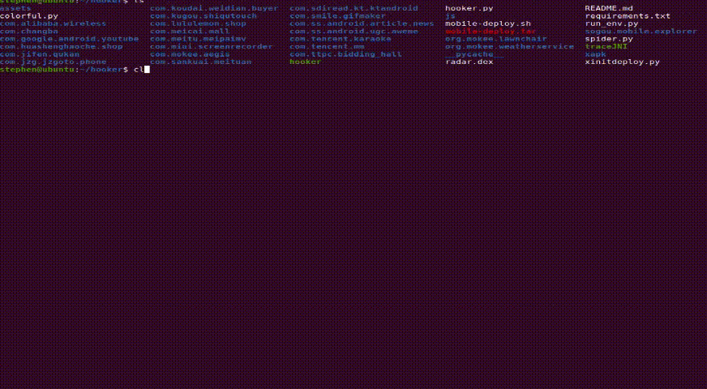
***

### 5. 指定fridaserver端口的手机开发环境部署

```shell
stephen@ubuntu:~/hooker$ adb shell #进入手机命令行界面
sailfish:/ $ su #进入root权限命令行模式
sailfish:/ $ sh /sdcard/mobile-deploy/deploy.sh 6666  #deploy.sh启动失败的同样可以尝试deploy2.sh                                                   
disable android firewall.
set firda_server_bind_port to 6666
start frida-server
start network adb.
deploy successfull.
stephen@ubuntu:~/hooker$ #如果你看到你的adb命令被弹出来了，表示已经正常部署。
```
***

注意：自定义frida server端口的开发环境必须走host:post的方式调试，因为usb默认找27042端口。所以请务必[更改本地.hooker_driver文件](#远程frida支持)，否则hooker无法正常工作。

### 6. 部署之后手机的增强功能
- 1.关闭iptables防火墙，解决部分手机默认防火墙开启的问题
- 2.启动frida-server，如果你的手机是arm64他将优先启动arm64位的frida-server
- 3.在/data/mobile-deploy目录生成tools_env.rc 当你有内网穿透和网络服务转发、编辑文件、检测网络方面的需求时可以执行source /data/mobile-deploy/tools_env.rc，它将临时生成vi、telnet、frpc、tcpforward、ll命令以便你进行更便捷的开发，如图
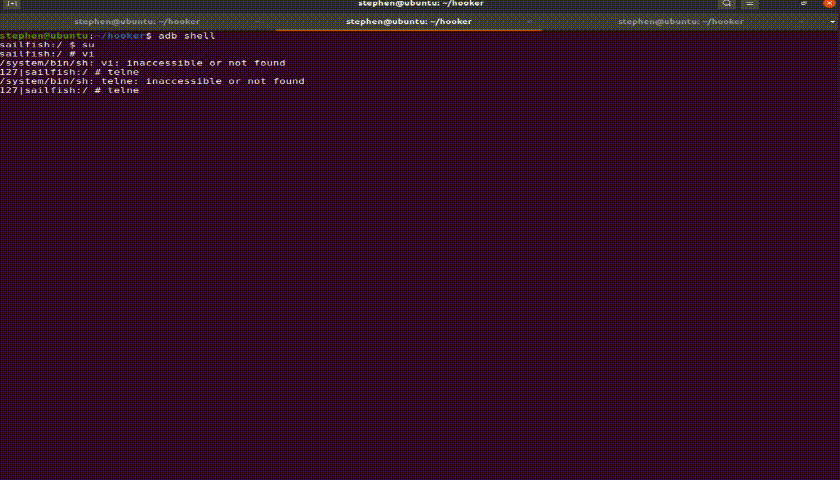
***
- 4.启动网络adb，即你可以直接通过远程adb调试手机。例如:adb connect 192.168.0.105

***


# 快速开始

### 1. 查看可调试进程
```shell
stephen@ubuntu:~/hooker$ ./hooker 
  PID  Name                           Identifier                                                   
-----  -----------------------------  -------------------------------------------------------------
 2857  Android Auto                   com.google.android.projection.gearhead                       
 1779  Android Services Library       com.google.android.ext.services                              
  929  Android 系统                     android                                                      
 5073  Carrier Services               com.google.android.ims                                       
11051  Device Health Services         com.google.android.apps.turbo                                
 2913  Device Personalization S…      com.google.android.as                                        
 2522  Google                         com.google.android.googlequicksearchbox                      
15189  Google Play 商店                 com.android.vending                                          
 2101  Google Play 服务                 com.google.android.gms                                       
 2833  Google VR 服务                   com.google.vr.vrcore                                         
 7710  Google 服务框架                    com.google.android.gsf                                       
 2546  NFC服务                          com.android.nfc                                              
  929  NetworkStack                   com.android.networkstack.inprocess                                                                   
  929  一体化位置信息                        com.android.location.fused                                   
14468  云端硬盘                           com.google.android.apps.docs                                 
14403  信息                             com.google.android.apps.messaging                            
12073  存储已屏蔽的号码                       com.android.providers.blockednumber                          
 1574  实时数据壁纸                         com.ustwo.lwp                                                
15637  抖音                             com.ss.android.ugc.aweme                                     
 2480  搜狗输入法                          com.sohu.inputmethod.sogou                                   
12073  用户字典                           com.android.providers.userdictionary                         
13362  电话                             com.google.android.dialer                                    
 1704  电话和短信存储                        com.android.providers.telephony                              
 1704  电话服务                           com.android.phone                                            
11818  知乎                             com.zhihu.android                                            
 1451  系统界面                           com.android.systemui                                         
12424  紧急警报                           com.android.cellbroadcastreceiver                            
12073  联系人存储                          com.android.providers.contacts                               
 1431  蓝牙                             com.android.bluetooth                                        
  929  设置存储                           com.android.providers.settings                               
10149  运营商设置                          com.google.android.wfcactivation                             
14376  通讯录                            com.google.android.contacts                                  
  929  通话管理                           com.android.server.telecom                                   
14807  阿里巴巴                           com.alibaba.wireless                                         
Enter the need to attach package.
: 
```

### 2. attach一个应用
```shell
stephen@ubuntu:~/hooker$ ./hooker
  PID  Name                           Identifier                                                   
-----  -----------------------------  -------------------------------------------------------------
15637  抖音                             com.ss.android.ugc.aweme                                     
 2480  搜狗输入法                          com.sohu.inputmethod.sogou                                   
12073  用户字典                           com.android.providers.userdictionary                         
13362  电话                             com.google.android.dialer                                    
 1704  电话和短信存储                        com.android.providers.telephony                              
 1704  电话服务                           com.android.phone                                            
11818  知乎                             com.zhihu.android                                            
 1451  系统界面                           com.android.systemui                                         
12424  紧急警报                           com.android.cellbroadcastreceiver                            
12073  联系人存储                          com.android.providers.contacts                               
 1431  蓝牙                             com.android.bluetooth                                        
  929  设置存储                           com.android.providers.settings                               
10149  运营商设置                          com.google.android.wfcactivation                             
14376  通讯录                            com.google.android.contacts                                  
  929  通话管理                           com.android.server.telecom                                   
14807  阿里巴巴                           com.alibaba.wireless                                         
Enter the need to attach package.
: com.ss.android.ugc.aweme  #在此处输入进程的Identifier即可调试应用
It's com.ss.android.ugc.aweme that you have attached app.
--------------------------------------------------
Please enter e, s, j, c or ex command.
a: Discovering activities.
b: Discovering services.
c: Discovering object. eg:'c {objectId}'
d: Object2Explain. eg:'d {objectId}'
v: Discovering view. eg:'v {viewId}'
e: Determines whether a class exists. eg:'e android.app.Application'
s: Discovering classes by a class'regex. eg:'s com.tencent.mm.Message.*'
t: Discovering offspring classes by a class'name. eg:'t com.tencent.mm.BasicActivity'
j: Generating hooked js. eg:'j okhttp3.Request$Builder:build'
k: Generating hooked the string generation js with a keyword. eg:'k {YourKeyword}'
l: Generating hooked the param generation js with a param keyword. eg:'l {YourKeyword}'
m: Discovering so module.
ex: Exit to the upper layer. eg:'ex'
: 
```
##### 提示1: 第一次调试你的应用时hooker将在当前目录生成以进程Identifier命名的应用专有工作目录，并初始化生成一些你可能会用到的通杀脚本。
##### 提示2: 成功attach一个应用时，命令将pause在等待输入调试指令的阶段。pause状态下使用命令进行高级调试请直接跳到[hooker调试命令行](#hooker调试命令行)
##### 提示3: attach时hooker会将[radar.dex](#radardex)文件拷贝到手机的/data/user/0/{package}/目录下
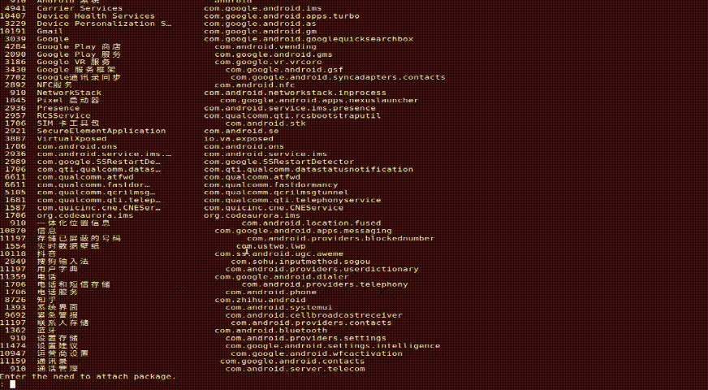


### 3. 应用工作目录
应用工作目录的意义在于提供一个的地方存放和管理frida脚本和快捷命令。hooker在你第一次调试应用时会创建应用工作目录，并初始化一些通杀脚本和快捷命令。

```shell
stephen@ubuntu:~/hooker/com.ss.android.ugc.aweme$ ls -l
total 784
-rw-rw-r-- 1 stephen stephen   7662 3月  16 20:55 activity_events.js
-rw-rw-r-- 1 stephen stephen   5790 3月  16 20:55 android_ui.js
-rwxrwxrwx 1 stephen stephen    102 8月   3  2020 attach
-rw-rw-r-- 1 stephen stephen   2242 8月   3  2020 click.js
-rw-rw-r-- 1 stephen stephen  12687 3月  23 22:23 com.bytedance.frameworks.core.encrypt.RequestEncryptUtils.js
-rw-rw-r-- 1 stephen stephen   4322 8月   3  2020 edit_text.js
-rwxrwxrwx 1 stephen stephen    159 8月   3  2020 hooking
-rwxrwxrwx 1 stephen stephen    101 8月   3  2020 kill
-rw-rw-r-- 1 stephen stephen 709448 3月  18 22:11 log
-rwxrwxr-x 1 stephen stephen     99 3月  16 20:55 objection
-rw-rw-r-- 1 stephen stephen   1226 3月  16 20:55 object_store.js
-rw-rw-r-- 1 stephen stephen   2553 3月  16 20:55 spider.py
-rw-rw-r-- 1 stephen stephen   2371 8月   3  2020 text_view.js
-rw-rw-r-- 1 stephen stephen   4789 3月  16 20:55 url.js
drwxrwxr-x 2 stephen stephen   4096 3月  25 21:21 xinit
-rwxrwxr-x 1 stephen stephen   5552 3月  16 20:55 xinitdeploy
```

# 应用工作目录的命令

### 1. hooking
hooking命令需要在后面跟一个脚本文件名作为参数，例如 ./hooking url.js。hooking实际上是在传统frida attach的基础上增加了将hook输出信息持久化到log文件中，比如当你hook一个调用非常频繁的函数比如某些字符串生成，输出的日志量无法短时间去全面，这时候你可以用文本编辑器打开log文件慢慢分析。以抖音工作目录为例，hooking实现如下

```shell
#!/bin/bash
HOOKER_DRIVER=$(cat ../.hooker_driver)
echo "hooking $1" > log
date | tee -ai log
frida $HOOKER_DRIVER -l $1 com.ss.android.ugc.aweme | tee -ai log
```


### 2. attach
attach同hooking类似，但是相比hooking少了日志持久化功能，这才是原生frida attach的命令。例如:./attach android_ui.js。以抖音工作目录为例，attach实现如下

```shell
#!/bin/bash
HOOKER_DRIVER=$(cat ../.hooker_driver)
frida $HOOKER_DRIVER -l $1 com.ss.android.ugc.aweme
```

### 3. spawn
以spawn模式启动脚本。某些方法在应用启动的时候就初始化了，想要hook这些方法就必须以spawn模式启动了。默认是--no-pause，即不需要手动resume恢复应用。如果需要非--no-pause，请手动编辑spawn文件去除。以抖音工作目录为例，spawn实现如下

```shell
#!/bin/bash
HOOKER_DRIVER=$(cat ../.hooker_driver)
frida $HOOKER_DRIVER --no-pause -f com.ss.android.ugc.aweme -l $1
```


### 4. objection
快捷执行objection调试命令，执行./objection即可。以抖音工作目录为例，objection实现如下

```shell
#!/bin/bash
HOOKER_DRIVER=$(cat ../.hooker_driver)
objection -d -g com.ss.android.ugc.aweme explore
```


### 5. xinitdeploy
xinitdeploy是用于部署资源的命令，它会把xinit目录下所放的文件拷贝到手机上/data/user/0/{packageName}/xinit/。同时保证资源文件的user/group权限和app进程是同一个临时用户。
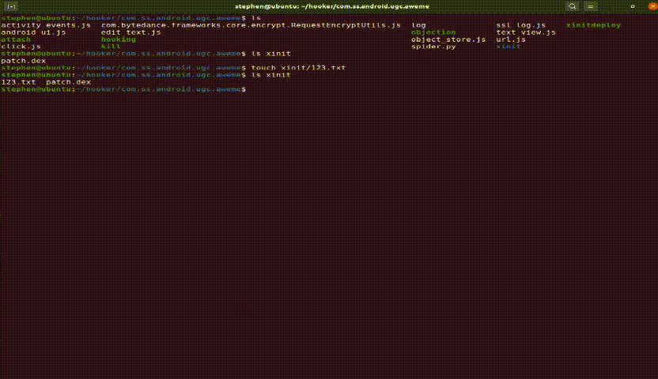
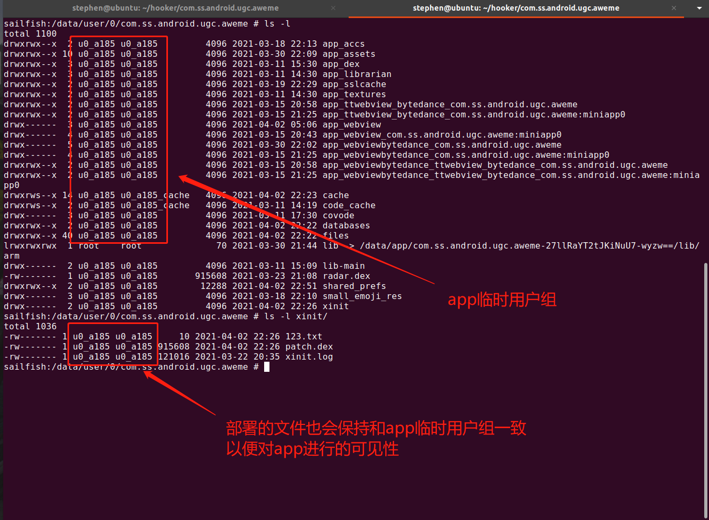

### 6. kill
如果你想重启app，先执行./kill会杀掉应用的主进程和所有子进程。作为一个Andrioid应用开发工程师出身，然后干到后台，接着干到爬虫，现在干到逆向的我必须告诉你：每个手机厂商都会实现一个自己的“内存清理”工具效果不一定好，且可能app本身也有保活机制。所以不建议你通过操作手机滑动进程列表来杀——有可能杀不干净。以抖音工作目录为例，kill实现如下:

```shell
#!/bin/bash
HOOKER_DRIVER=$(cat ../.hooker_driver)
frida-kill $HOOKER_DRIVER com.ss.android.ugc.aweme
```


### 7. disable_sslpinning
快速关闭ssl pinning，此命令基于objection源码实现和[frida版just_trust_me](#11-just_trust_mejs)互补。当just_trust_me失效的时候，可以使用disable_sslpinning。反之，使用[just_trust_me](#11-just_trust_mejs)。

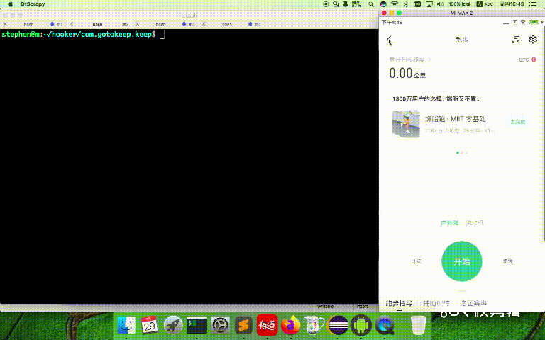


# 应用工作目录的通杀脚本

### 1. url.js
需要跟踪url生成时可执行./hooking url.js


### 2. activity_events.js
当你需要跟踪start某个Activity启动时可执行，获取startActivity的intent信息和调用堆栈。/hooking activity_events.js


### 3. click.js
跟踪点击事件时可执行，并获取被点击View的真实VClass（很重要）。获取到了Class，你就可以在jadx找到这个View绑定事件代码。多一种办法定位到关键逻辑不好吗？一定要靠分析网络请求吗？条条大路通罗马，不一定非从网络库分析！ /hooking click.js
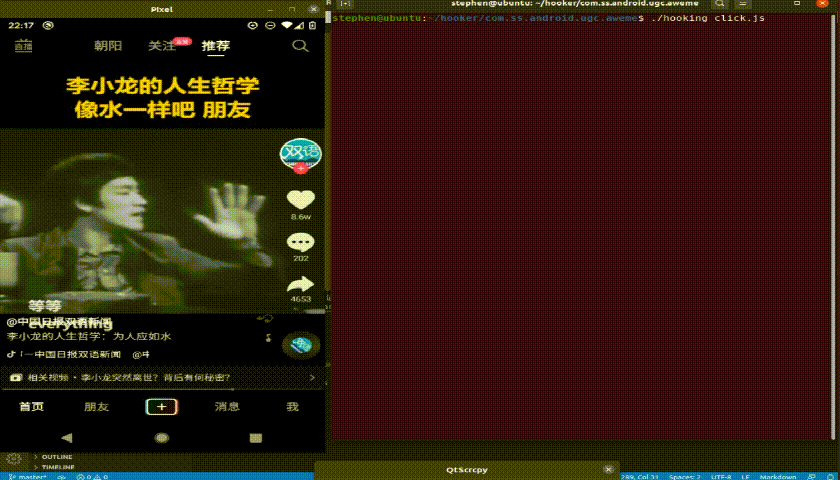

### 4. android_ui.js
封装一些操作原生Android UI的函数。如startActivity(activityName)、home()、back()、finishCurrentActivity()、clickByText(text) 等等，命令使用得用attach './attach android_ui.js' 原理是借助radar.dex作为代理操作Android原生View。（tag）
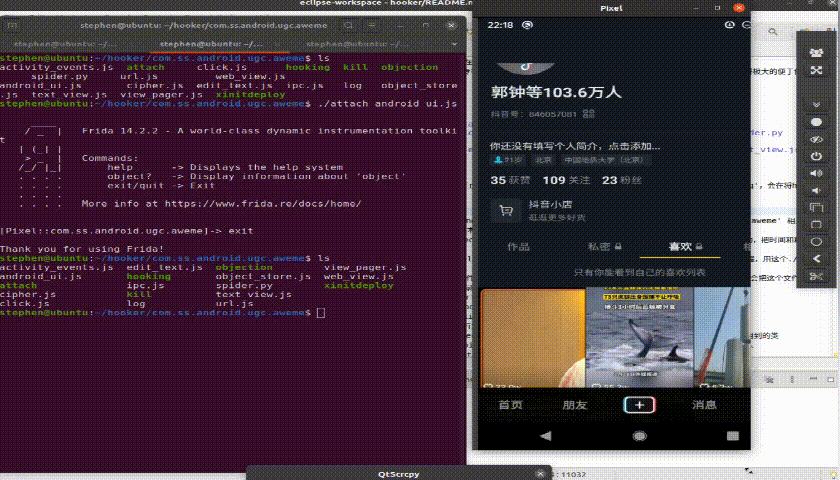
***

### 5. keystore_dump.js
在https双向认证的情况下，dump客户端证书为p12。存储位置:/data/user/0/{packagename}/client_keystore_{nowtime}.p12 证书密码: hooker。原理是hook java.security.KeyStore的getPrivateKey和getCertificate方法，因为客户端向服务发送证书必调这个方法。强烈建议keystore_dump.js用spawn模式启动，启动命令为 ./spawn keystore_dump.js 。下面是某app双向认证dump客户端证书过程
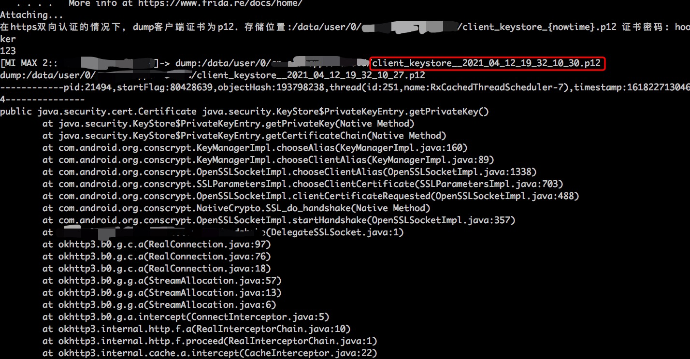
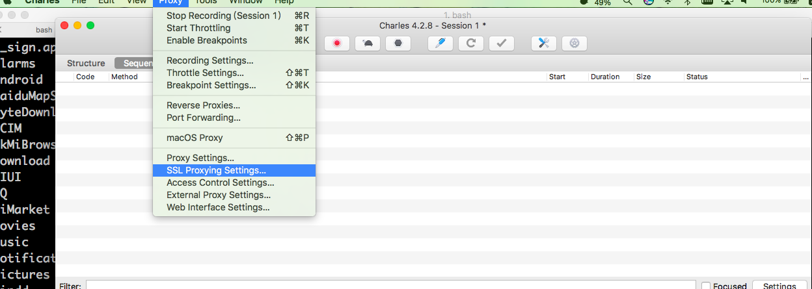
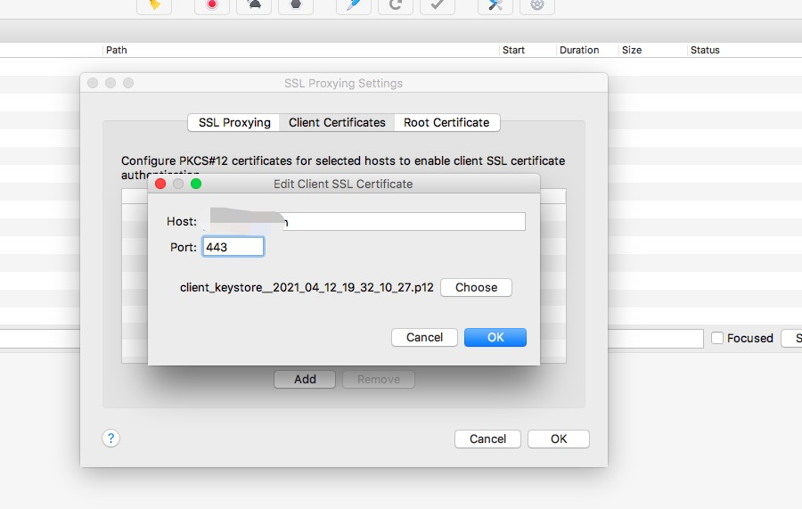
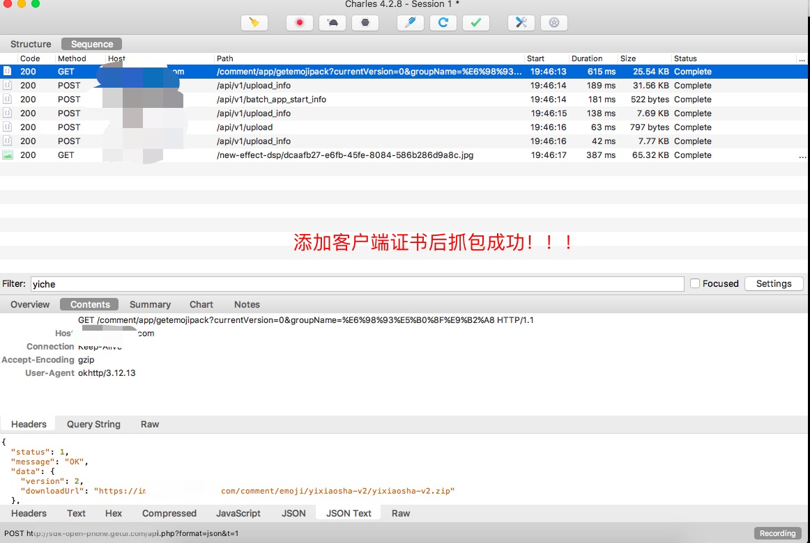

### 6. edit_text.js
跟踪获取Editview的getText()事件，并获取Editview的真实Class（很重要）。Editview一般绑定Search Action的实现代码，如果你抓取“搜索”接口。那么这个一定可以帮助你定位发送搜索请求的相关代码。多一种办法定位到关键逻辑不好吗？一定要靠分析网络请求吗？条条大路通罗马，不一定非从网络库分析！


### 7. text_view.js
跟踪TextView的setText和getText，获取TextView的真实Class。一般setText的堆栈信息会带出业务层的数据model处理逻辑，进而进一步分析到业务层数据bean封装类。
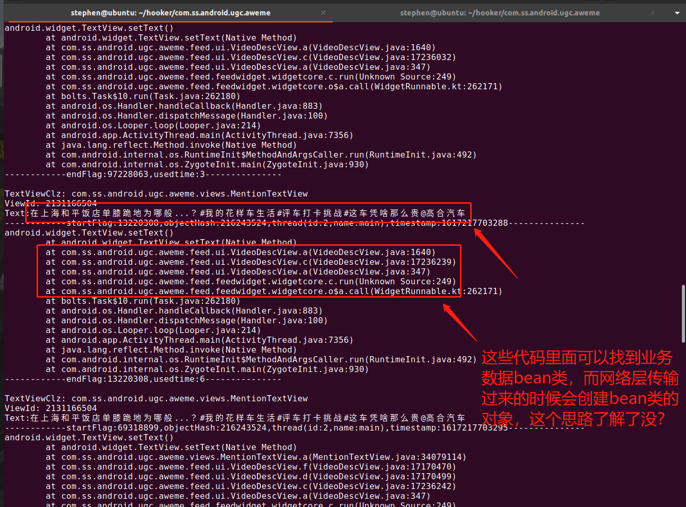

### 8. ssl_log.js
在native层跟踪ssl握手并记录CLIENT RANDOM，tcpdump出来的链路层pacp里面的TLS包可以用CLIENT RANDOM记录文件解出来，将在高级篇讲解使用步骤。

### 9. object_store.js
操作ObjectId标识的对象，根据自身分析情况可进行特定的序列化打印、操作对象的私有成员变量。
实践文章：https://bbs.pediy.com/thread-267245.htm

### 10. hook_RN.js
对于动态注册的native函数，我们需要用hook_register_natives.js来分析。建议用spawn模式启动，启动命令为 ./spawn hook_register_natives.js
当hook_RN.js无法找到native函数时，试试[15. hook_artmethod_register.js](#15-hook_artmethod_registerjs)


### 11. just_trust_me.js
frida版本的just_trust_me。如果你需要bypass sslpinning请执行./spawn just_trust_me.js

下面以Twitter为例，启动just_trust_me.js
启动演示
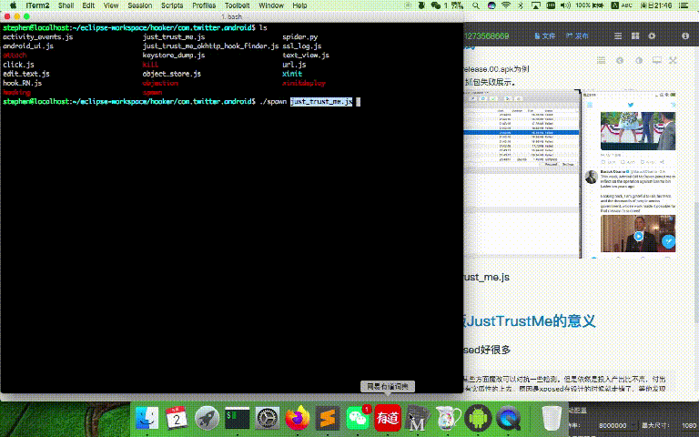

抓包效果演示


### 12. just_trust_me_okhttp_hook_finder.js
为配合just_trust_me.js在okhttp混淆场景下辅助你找到混淆点 
jadx打开某资讯apk发现okhttp3如下
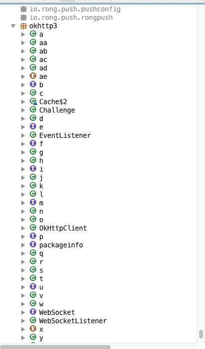

执行./hooking just_trust_me_okhttp_hook_finder.js命令扫描hook点
```shell
-----------------------------------------------------------------------
原类名：okhttp3.CertificatePinner
混淆类名：okhttp3.g


混淆方法0:
原方法签名：public void okhttp3.CertificatePinner.check(java.lang.String,java.util.List)
混淆方法签名：public void okhttp3.g.a(java.lang.String,java.util.List) throws javax.net.ssl.SSLPeerUnverifiedException


-----------------------------------------------------------------------
原类名：okhttp3.OkHttpClient$Builder
混淆类名：okhttp3.OkHttpClient$Builder


自动定位混淆方法失败，请去jadx打开okhttp3.OkHttpClient$Builder手动分析混淆方法
-----------------------------------------------------------------------
原类名：okhttp3.internal.tls.OkHostnameVerifier
混淆类名：okhttp3.internal.i.d


混淆方法0:
原方法签名：public boolean okhttp3.internal.tls.OkHostnameVerifier.verify(java.lang.String,javax.net.ssl.SSLSession)
混淆方法签名：public boolean okhttp3.internal.i.d.verify(java.lang.String,javax.net.ssl.SSLSession)


混淆方法1:
原方法签名：public boolean okhttp3.internal.tls.OkHostnameVerifier.verify(java.lang.String,java.security.cert.X509Certificate)
混淆方法签名：public boolean okhttp3.internal.i.d.a(java.lang.String,java.security.cert.X509Certificate)

-----------------------------------------------------------------------
```
根据上面just_trust_me_okhttp_hook_finder.js跑的结果
把okhttp3的hook点改成混淆的类：

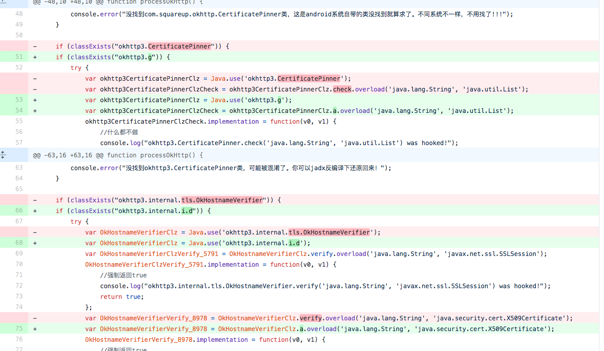
这个提交记录：https://github.com/CreditTone/hooker/commit/f47d2068320a58306735a623f12bd955cbd20632

jadx打开某资讯apk发现okhttp3如下


### 13. trace_init_proc.js
init_proc的hook实现比较麻烦，这边给一个实现模版，你需要把脚本中init_proc函数的startAddr、endAddr补充上，somodule是你so的名字，这样你就可以trace init_proc了
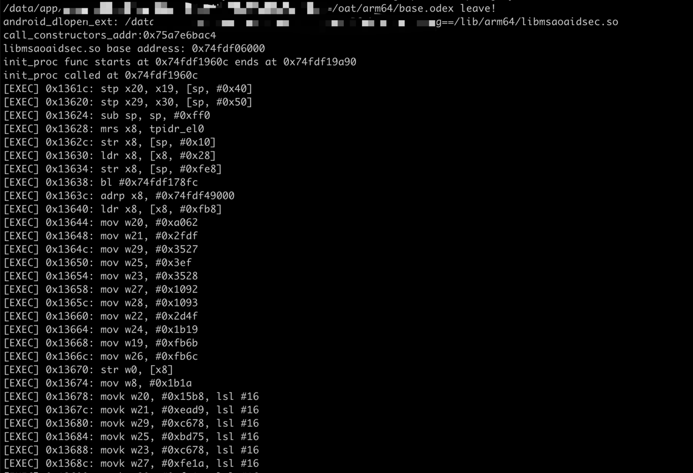

### 14. dump_dex.js
执行./spawn dump_dex.js即可脱壳，针对大部分简单的壳可以脱。ART下引入了dex2oat来对dex进行编译，生成每一个java函数对应的native代码，来提高运行效率。有时候如果不能脱你需求删除/data/app/<package_name>-*/oat/arm64/目录下的所有文件再执行，如果还不能脱就gg了
```javascript
MacBook-Pro-32G-2T:com.shxpxx.sg stephen256$ ./spawn dump_dex.js
     ____
    / _  |   Frida 14.2.2 - A world-class dynamic instrumentation toolkit
   | (_| |
    > _  |   Commands:
   /_/ |_|       help      -> Displays the help system
   . . . .       object?   -> Display information about 'object'
   . . . .       exit/quit -> Exit
   . . . .
   . . . .   More info at https://www.frida.re/docs/home/
Spawning `com.shxpxx.sg`...
_ZN3art11ClassLinker11DefineClassEPNS_6ThreadEPKcmNS_6HandleINS_6mirror11ClassLoaderEEERKNS_7DexFileERKNS9_8ClassDefE 0x7521584e08
[DefineClass:] 0x7521584e08
Spawned `com.shxpxx.sg`. Resuming main thread!
[MI MAX 3::com.shxpxx.sg]-> [find dex]: /data/data/com.shxpxx.sg/files/dump_dex_com.shxpxx.sg/classes.dex
[dump dex]: /data/data/com.shxpxx.sg/files/dump_dex_com.shxpxx.sg/classes.dex
[find dex]: /data/data/com.shxpxx.sg/files/dump_dex_com.shxpxx.sg/classes2.dex
[dump dex]: /data/data/com.shxpxx.sg/files/dump_dex_com.shxpxx.sg/classes2.dex
[find dex]: /data/data/com.shxpxx.sg/files/dump_dex_com.shxpxx.sg/classes3.dex
[dump dex]: /data/data/com.shxpxx.sg/files/dump_dex_com.shxpxx.sg/classes3.dex
[find dex]: /data/data/com.shxpxx.sg/files/dump_dex_com.shxpxx.sg/classes4.dex
[dump dex]: /data/data/com.shxpxx.sg/files/dump_dex_com.shxpxx.sg/classes4.dex
[find dex]: /data/data/com.shxpxx.sg/files/dump_dex_com.shxpxx.sg/classes5.dex
[dump dex]: /data/data/com.shxpxx.sg/files/dump_dex_com.shxpxx.sg/classes5.dex
[find dex]: /data/data/com.shxpxx.sg/files/dump_dex_com.shxpxx.sg/classes6.dex
[dump dex]: /data/data/com.shxpxx.sg/files/dump_dex_com.shxpxx.sg/classes6.dex
[find dex]: /data/data/com.shxpxx.sg/files/dump_dex_com.shxpxx.sg/classes7.dex
[dump dex]: /data/data/com.shxpxx.sg/files/dump_dex_com.shxpxx.sg/classes7.dex
[find dex]: /data/data/com.shxpxx.sg/files/dump_dex_com.shxpxx.sg/classes8.dex
[dump dex]: /data/data/com.shxpxx.sg/files/dump_dex_com.shxpxx.sg/classes8.dex
[find dex]: /data/data/com.shxpxx.sg/files/dump_dex_com.shxpxx.sg/classes9.dex
[dump dex]: /data/data/com.shxpxx.sg/files/dump_dex_com.shxpxx.sg/classes9.dex
[find dex]: /data/data/com.shxpxx.sg/files/dump_dex_com.shxpxx.sg/classes10.dex
[dump dex]: /data/data/com.shxpxx.sg/files/dump_dex_com.shxpxx.sg/classes10.dex
```

### 15. hook_artmethod_register.js
有时候hook_RN.js无法hook到RegisterNatives方法，那是因为厂商直接自实现了RegisterNatives，方法下沉到了ArtMethod.RegisterNative方法
先执行./xinitdeploy将扩展的so部署到应用目录，再执行./spawn hook_artmethod_register.js hook ArtMethod RegisterNative

```shell
MacBook-Pro-32G-2T:com.shxpxx.sg stephen256$ ./xinitdeploy
copying libext64.so to path: /data/data/com.shxpxx.sg/libext64.so
copying libext.so to path: /data/data/com.shxpxx.sg/libext.so
deploying xinit finished.
MacBook-Pro-32G-2T:com.shxpxx.sg stephen256$ ./spawn hook_artmethod_register.js
     ____
    / _  |   Frida 14.2.2 - A world-class dynamic instrumentation toolkit
   | (_| |
    > _  |   Commands:
   /_/ |_|       help      -> Displays the help system
   . . . .       object?   -> Display information about 'object'
   . . . .       exit/quit -> Exit
   . . . .
   . . . .   More info at https://www.frida.re/docs/home/
Spawning `com.shxpxx.sg`...
ArtMethod::PrettyMethod is at  0x7521538e60 _ZN3art9ArtMethod12PrettyMethodEb
ArtMethod::RegisterNative is at  0x75215391b0 _ZN3art9ArtMethod14RegisterNativeEPKv
Spawned `com.shxpxx.sg`. Resuming main thread!
[MI MAX 3::com.shxpxx.sg]-> [ArtMethod_RegisterNative] Method_sig: int com.qualcomm.qti.Performance.native_perf_lock_acq(int, int, int[]) module_name: libqti_performance.so offset: 0x19f0
[ArtMethod_RegisterNative] Method_sig: int com.qualcomm.qti.Performance.native_perf_lock_rel(int) module_name: libqti_performance.so offset: 0x1abc
[ArtMethod_RegisterNative] Method_sig: int com.qualcomm.qti.Performance.native_perf_hint(int, java.lang.String, int, int) module_name: libqti_performance.so offset: 0x1ad8
[ArtMethod_RegisterNative] Method_sig: int com.qualcomm.qti.Performance.native_perf_get_feedback(int, java.lang.String) module_name: libqti_performance.so offset: 0x1b90
[ArtMethod_RegisterNative] Method_sig: int com.qualcomm.qti.Performance.native_perf_io_prefetch_start(int, java.lang.String, java.lang.String) module_name: libqti_performance.so offset: 0x1c24
[ArtMethod_RegisterNative] Method_sig: int com.qualcomm.qti.Performance.native_perf_io_prefetch_stop() module_name: libqti_performance.so offset: 0x1e58
[ArtMethod_RegisterNative] Method_sig: int com.qualcomm.qti.Performance.native_perf_uxEngine_events(int, int, java.lang.String, int) module_name: libqti_performance.so offset: 0x1f80
[ArtMethod_RegisterNative] Method_sig: java.lang.String com.qualcomm.qti.Performance.native_perf_uxEngine_trigger(int) module_name: libqti_performance.so offset: 0x2154
[ArtMethod_RegisterNative] Method_sig: void com.tencent.mmkv.MMKV.onExit() module_name: libmmkv.so offset: 0x1717c
[ArtMethod_RegisterNative] Method_sig: java.lang.String com.tencent.mmkv.MMKV.cryptKey() module_name: libmmkv.so offset: 0x17180
[ArtMethod_RegisterNative] Method_sig: boolean com.tencent.mmkv.MMKV.reKey(java.lang.String) module_name: libmmkv.so offset: 0x1727c
[ArtMethod_RegisterNative] Method_sig: void com.tencent.mmkv.MMKV.checkReSetCryptKey(java.lang.String) module_name: libmmkv.so offset: 0x17478
```

### 16. find_anit_frida_so.js
某些可恶的app会对frida进行反调试，用这个可以对反调试的so进行找出。原理是谁最后一个被加载，谁就是坏淫
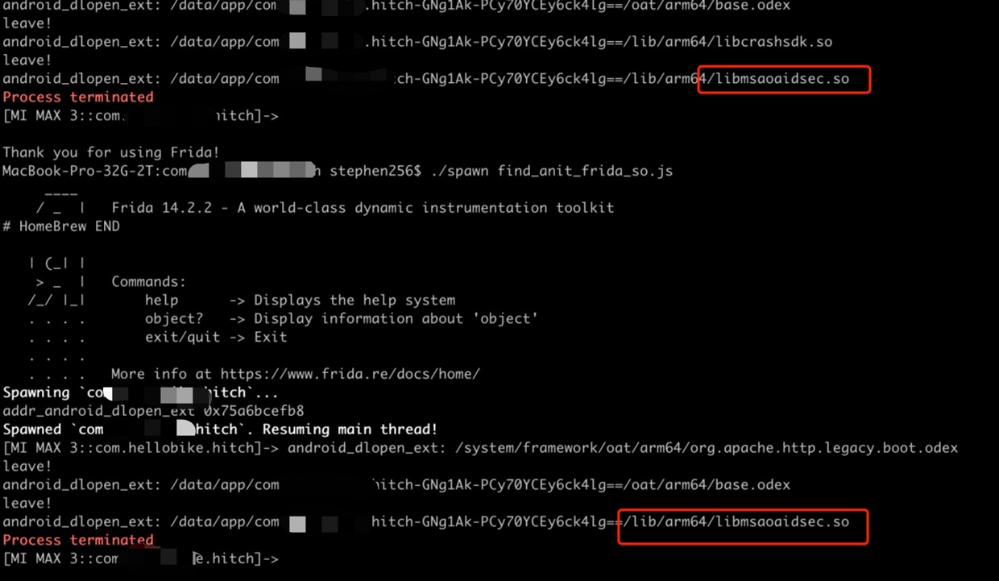

### 17. hook_jni_method_trace.js
Native层调java时追踪一些方法，用于确定so层的调用栈，hook的地方比较多，打印有些凌乱，你需要根据自身需求精简打印和增加更多打印的信息

### 18. replace_dlsym_get_pthread_create.js
libmsaoaidsec.so版本有很多，而且在很多app中广泛存在。大致分为2类一个是通过got表导入了pthread_create函数创建了反调试线程，这个你直接去ida so搜索pthread_create函数NOP。第二是用dlsym动态加载libc.so库来获取pthread_create函数指针，这个我们直接用frida hook dlsym函数就可以劫持
我预计，将来厂商可能会下沉到svc或者通过其他so来启动线程，到那时候我们再说。这边先给了通用实现，专门用来对抗dlsym版本的libmsaoaidsec.so
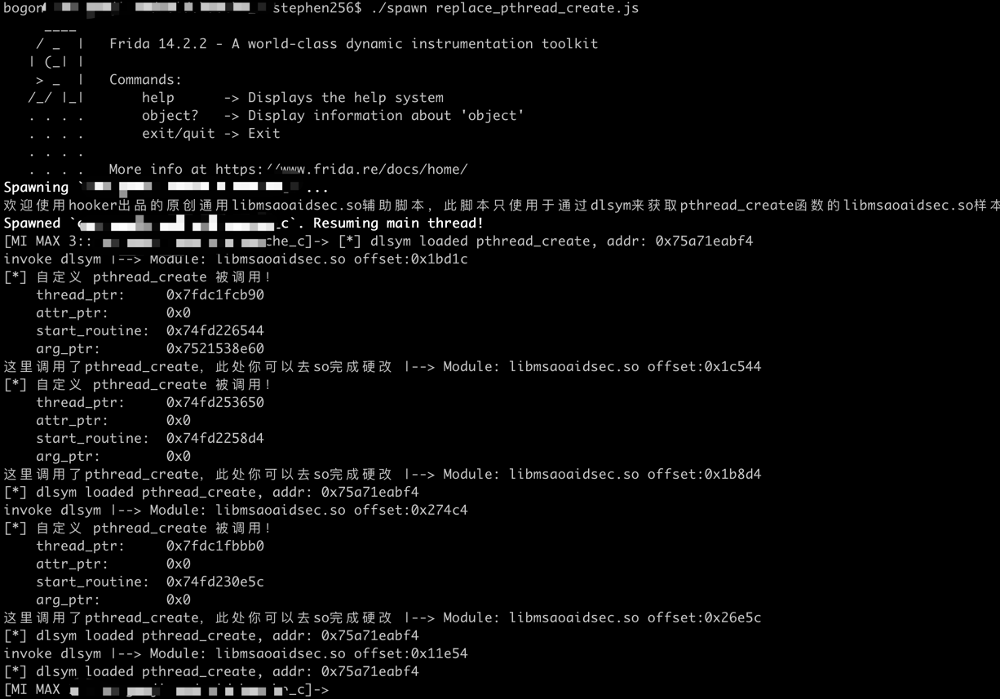


### 19. find_boringssl_custom_verify_func.js
专门用于查找boringssl的验证函数，boringssl现在学聪明了，验证函数没有了之前的字符串特征。我们需要hook SSL_CTX_set_custom_verify把验证函数找出来，随后进行hook强制返回0
执行./spawn find_boringssl_custom_verify_func.js之前记得清除某音app所有的数据缓存，因为某些函数只会注册一次。


找到几个验证函数后，我们再实现hook验证函数强制返回0，如下
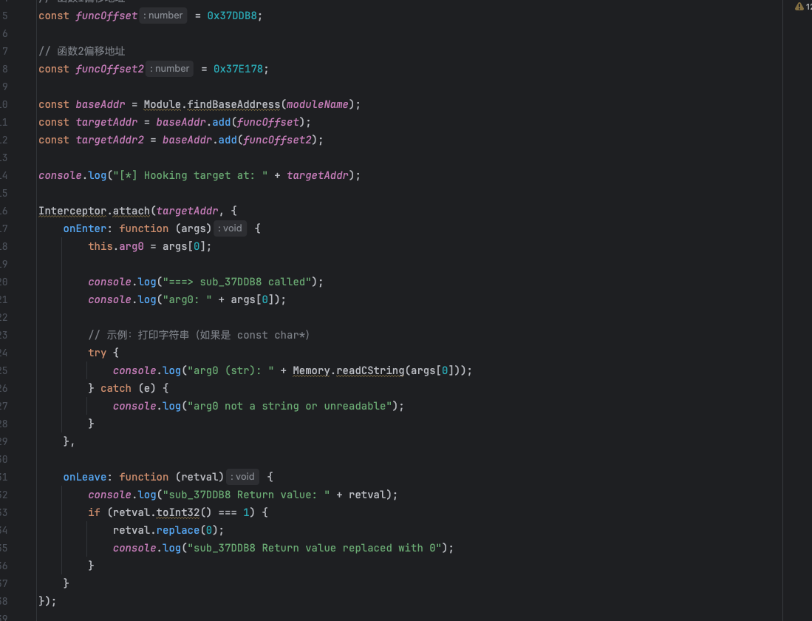

抓包效果


# hooker调试命令行

### a - 打印Activity栈
打印Activity栈的所有实例，当前界面排最前面。你可以立刻获取当前手机界面的Activity实现类、继承关系、实现接口、Activity中的所有属性值和方法声明。配合jadx动静分析效果最佳，分析Activity对象的内部情况将极快的提供逆向的线索。值得注意的是Activity中每个成员变量hooker会分配一个ObjectId，这是为了让你用c命令对内部成员变量进行扫描的。


### b - 打印Service栈
打印Service栈的所有实例。和a命令一样，获取当前手机界面的Service实现类、继承关系、实现接口、Service中的所有属性值和方法声明。配合jadx动静分析效果最佳，分析Service对象的内部情况将极快的提供逆向的线索。值得注意的是Service中每个成员变量hooker会分配一个ObjectId，这是为了让你用c命令对内部成员变量进行扫描的。
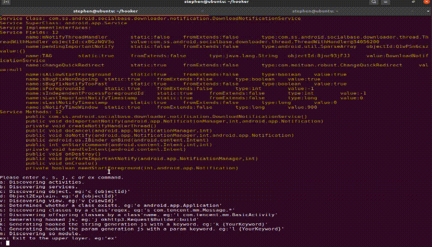

### c - 扫描指定Object
扫描指定ObjectId的对象，a、b命令扫描Activity和Service带出一托线索。结合jadx观察之成员变量的类型和值情况，你一定可以发现一些新的对象，想窥视之。那么请用c命令扫描吧，而c命令扫描完之后又会带出新的你感兴趣的线索（对象）。顺藤摸瓜，你可以找到很多有趣东西。
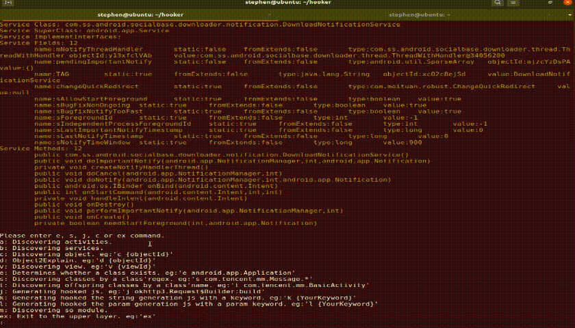

### d - 展开Object[]、List或Map
展开一个Object[]、List或Map，并以Index/key->value的形式打印出来，从而进一步获取集合对象内部的每个对象类型和ObjectId。比如我们通过a命令查看某Activity发现属性o是一个Fragment数组'name:o	static:false	fromExtends:false	type:[Landroidx.fragment.app.Fragment; objectId:tGErGHXLso	value:[Landroidx.fragment.app.Fragment;@94023208'，那么这个数组里面每个成员是什么我们就可以用d命令对其进行展开了。
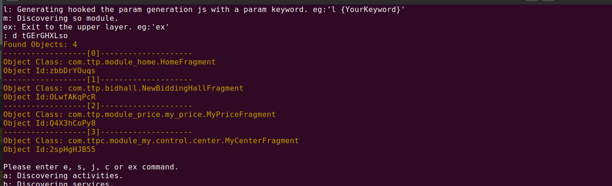

### v - 以View的方式查看对象
以View的方式查看一个对象，除了有c命令全部的功能之外。v命令会先强转对象为View,然后获取view绑定的OnClickListener、OnLongClickListener、OnTouchListener、OnFocusChangeListener、OnEditorActionListener、OnItemClickListener等等，这些对象也将完全探测出来。比如对于属性:'name:h	static:false	fromExtends:false	type:com.ttpc.bidding_hall.weight.HomeTabButton	viewId:2131297762	objectId:GKuWPZOyY0	value:com.ttpc.bidding_hall.weight.HomeTabButton@227103246' 如下图用v命令查看我们可以发现HomeTabButton绑定了一个点击事件com.ttpai.track.g，这样的话你去jadx找到这个类就知道处理这个按钮的逻辑啦！！！此外，v 命令还可以跟上ViewId，但是ViewId对于每个View不一定都存在并且也不一定唯一，这个具体细节可以了解Android应用开发。
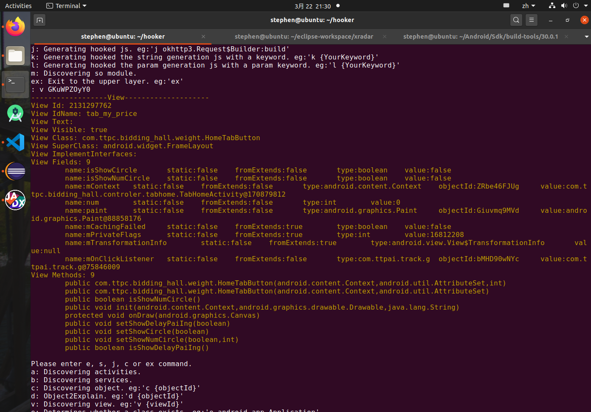

### e - 检测类在内存中是否存在
检测一个类在内存中是否存在。大部分情况下静态分析的类在内存中会存在，但是有时app会做热更新可能会出现类被替换的情况。作为一个严谨的逆向工程师在对类进行操作之前检测类是否存在内存中是个好习惯。如：e com.bytedance.frameworks.encryptor.EncryptorUtil 输出：True表示存在 False表示不存在
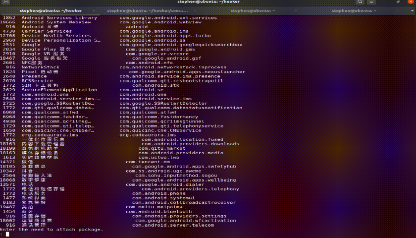

### s - 正则表达式扫描类
用正则表达式在内存中扫描类。比如你对某些关键词类感兴趣，完全可以使用s进行扫描。配合jadx查看类实现代码爽歪歪！当然jadx自带类搜索功能但是只是静态的，并且jadx搜索功能是吃内存的，没有32G内存使用起来好卡。这时候s命令或许你是不错的选择。
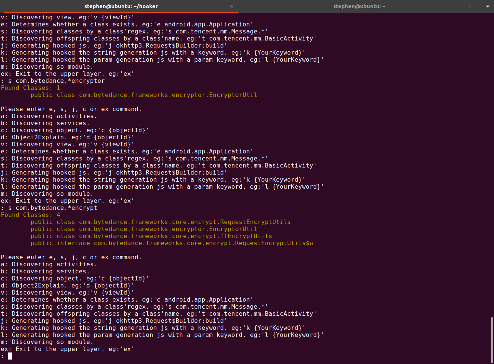

### j - 生成指定类的hook脚本
生成指定类名称的hook脚本，也是hooker最核心的功能之一。相比objection，hooker生成的脚本有标注生产脚本的apk版本和类名。并且每个方法内部已经具备打印堆栈的功能，包括调用时间、线程id、线程名、调用对象的hashcode，调用方法用时都有很详细的描述。
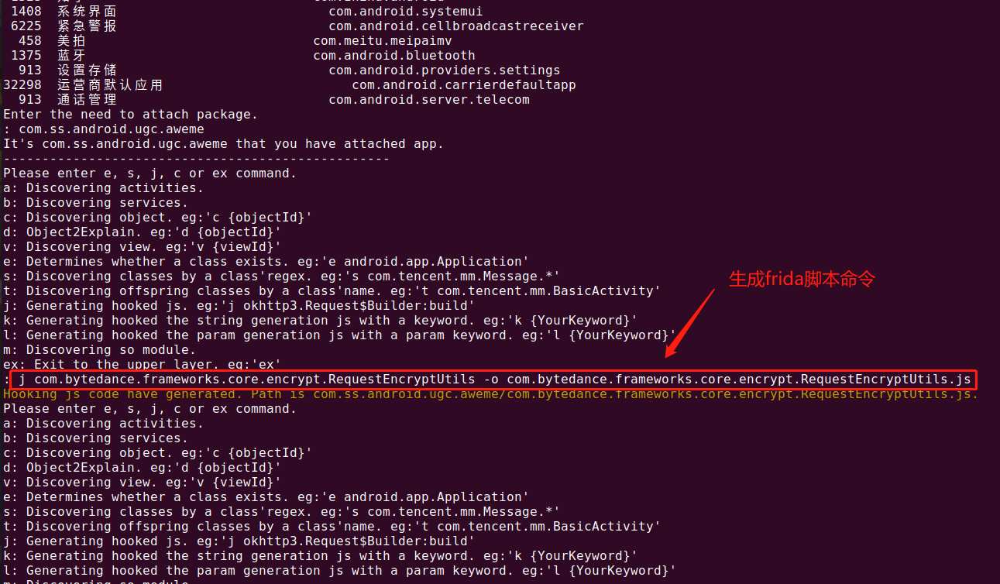
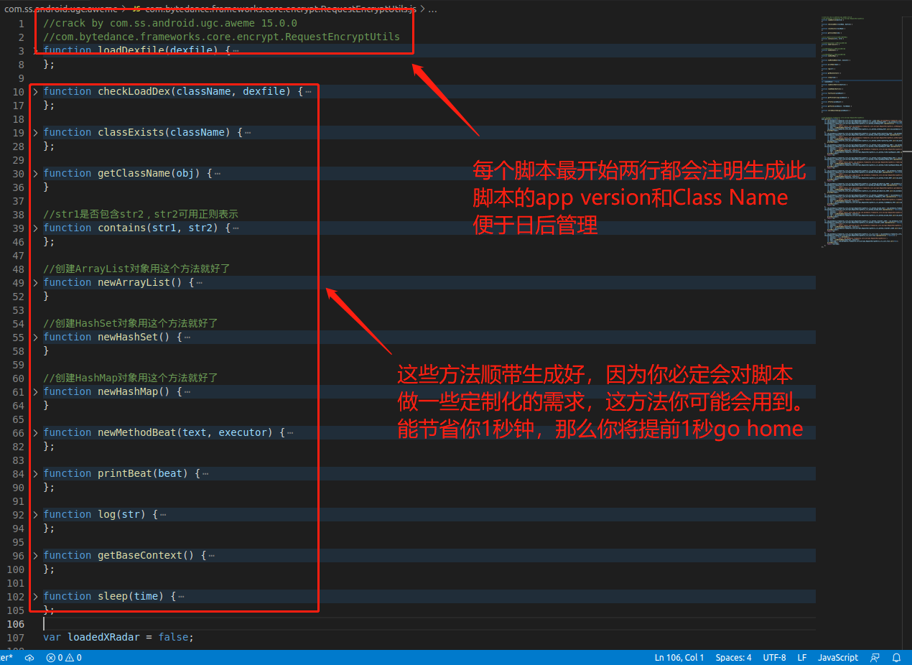
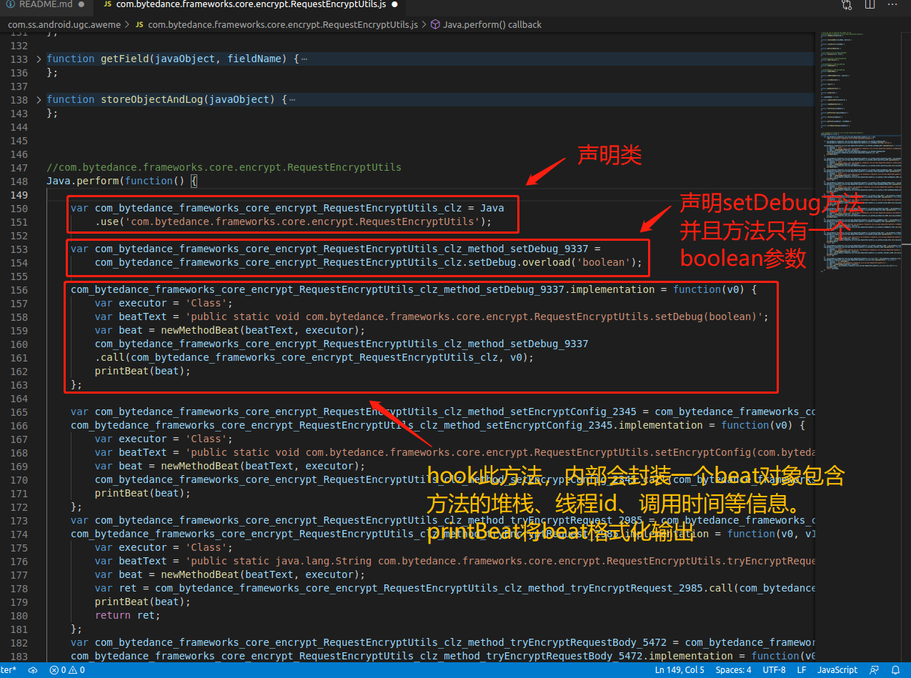

### j - 生成指定类方法的hook脚本
生成指定方法的hook脚本，j [类名]:[方法名]
j java.lang.System:loadLibrary
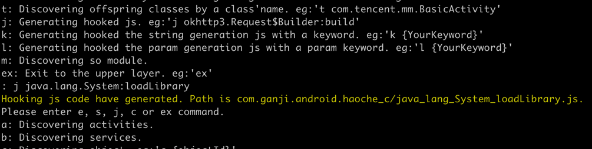
 脚本如图所示
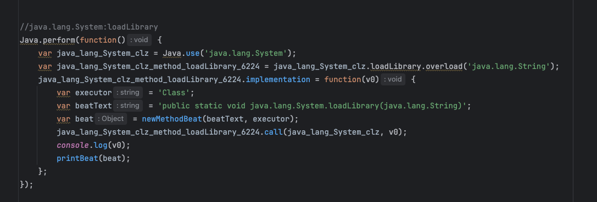

hooker生成脚本和objection生成脚本优势对比

| 项目        | 生成脚本命令   |  能否打印堆栈  |  包含辅助方法  |  脚本版本信息注释  |  脚本可定制性  |
| --------   | -----:  | :----:  | :----:  | :----:  | :----:  |
| hooker      | j [class_name] -o [outputpath].js   |   能     |   包含     |   带apk version和生成命令     |   好     |
| objection        |   android hooking generate simple [class_name]  |   不能（白纸一张）   |   不包含     |   不带     |   一般     |

### k - 生成字符串hook脚本
使用k 1821053，那么应用工作目录下会生成str_1821053.js。只要字符串产生并包含1821053这个关键词，就会打印产生地方的堆栈信息。原理基于java字符串拼接代码，编译后变成StringBuilder做append

```java
String url = "http://www.example.com/login?"+ "sign=" + getSign();
```

以上代码编译后会生成如下

```java
String url = new StringBuilder("http://www.example.com/login?").append("sign=").append(getSign()).toString();
```

不过这个思路有点儿类似暴力破解，而且非常影响app进程的运行速度，崩溃也是可能的。我的认为只要能搞出一些线索，崩溃也是值得的。崩溃我重启就是了。你觉得呢？


hooker高级应用
=================

## radar.dex
在hooker根目录中有一个radar.dex，这是为操作java类的增强库。

## 脚本的内置函数
脚本是frida的核心，一个脚本不能只做打印堆栈信息的事情。我们还要进一步深挖脚本的潜在价值。比如我们改变被hook对象的内部成员变量的值、直接调用对象的方法、patch我们的dex。所以在hooker生成的每个脚本当中，我还内置了你可能需要用到的方法用于定制脚本。下面我就开始介绍这些方法的作用吧。

### 1. loadDexfile(dexfile)
加载一个dex文件到app进程中。dexfile是dex在手机上绝对路径，调用此方法必须保证dex文件用户和组权限对app进程的可见性。

### 2. checkLoadDex(className， dexfile)
先检测className是否存在内存中，如果不存在加载一个dex文件到app进程中。dexfile是dex在手机上绝对路径，调用此方法必须保证dex文件用户和组权限对app进程的可见性。

### 3. loadXinitDexfile(dexfile)
加载一个dex文件到app进程中。与loadDexfile、checkLoadDex不同，此方法直接从/data/user/0/{packageName}/xinit/路径下找dex文件。比如我们要加载上面基于[xinitdeploy](#4-xinitdeploy)命令部署的patch.dex，直接loadXinitDexfile("patch.dex");就可以给app进程注入dex了。到了这里你明白[xinitdeploy](#4-xinitdeploy)的良苦用心了没有！

### 4. loadXRadarDexfile()
加载radar.dex文件到app进程中。radar.dex内部包含操作java对象的增强功能，如果你需要使用fastTojson、getPrettyString、storeObjectAndLog等方法，必需在脚本加载时调用一次loadXRadarDexfile()。

### 5. fastTojson(javaObject)
基于radar.dex中fastjson序列化一个java对象为json字符串。该方法依赖radar.dex，使用前必须loadXRadarDexfile()。注意loadXRadarDexfile()进行一次即可，无需多次调用。

### 6. getPrettyString(javaObject)
类似与toString()，与toString()不同的是它将判断子类是否实现toString方法，如果没有现实toString或者类是android.os.Parcelable可能会引起循环调用的异常，所以getPrettyString会根据情况采用[className]@[hashCode]的方法来规避。该方法依赖radar.dex，使用前必须loadXRadarDexfile()。注意loadXRadarDexfile()进行一次即可，无需多次调用。

### 7. getField(javaObject, fieldName)
获取对象的属性，这是来弥补frida语法中this.a.b.c.d深度查找的不足。该方法依赖radar.dex，使用前必须loadXRadarDexfile()。注意loadXRadarDexfile()进行一次即可，无需多次调用。

在frida中深度查找是不支持的，以下方式获取对象将发生错误。
```js
let d = this.a.b.c.d;
```
所以你可以使用getField(javaObject, fieldName)来替代以上的逻辑
```js
let aObj = getField(this, "a");
let bObj = getField(aObj, "b");
let cObj = getField(bObj, "c");
let dObj = getField(cObj, "d");
```

### 8. storeObjectAndLog(javaObject)
将对象存储至对象缓存中，同时输出对象缓存id。然后你可以用c [objectId]，扫描对象，这将帮助你更好的窥视内存。该方法依赖radar.dex，使用前必须loadXRadarDexfile()。注意loadXRadarDexfile()进行一次即可，无需多次调用。

### 9. printAndCloneOkhttp3Request
有时候你抓包会发现请求存在请求体和响应二次加密，我们需要从内存hook打印request，而当Okhttp3Request对象是post的时候，你读取body会消耗一次，使后面的请求不成功，这时候我们就要克隆一个新的Request
hooker为每个自动生成的hook脚本都添加了printAndCloneOkhttp3Request方法只需要简单的调用即可输出request内容
```javascript
 var com_xxxx_networking_crypto_utils_XXXXHelper_clz_method_a_8315 = com_xxxx_networking_crypto_utils_XXXXXHelper_clz.a.overload('okhttp3.Request', 'java.lang.String');
    com_xxxx_networking_crypto_utils_XXXXXHelper_clz_method_a_8315.implementation = function(v0, v1) {
        var executor = this.hashCode();
        var beatText = 'public final okhttp3.Request com.xxxx.networking.crypto.utils.XXXXXHelper.a(okhttp3.Request,java.lang.String)';
        var beat = newMethodBeat(beatText, executor);
        var newReq = printAndCloneOkhttp3Request(v0);
        var ret = com_xxxx_networking_crypto_utils_XXXXXHelper_clz_method_a_8315.call(this, newReq, v1);
        printBeat(beat);
        return ret;
    };
```
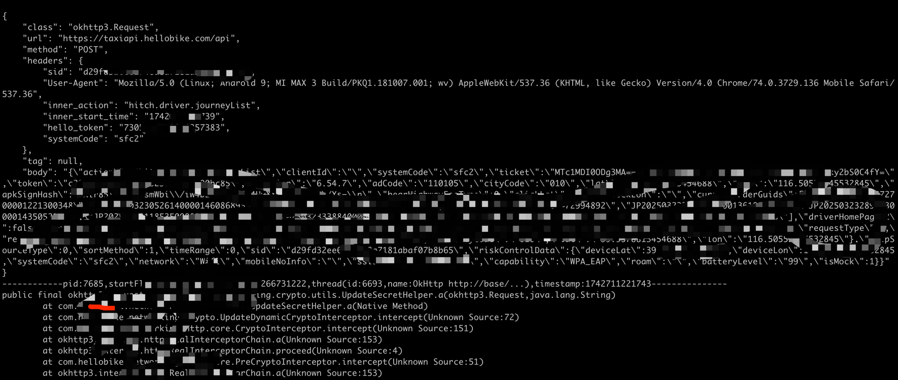

## 原生ui自动化
hooker借助radar.dex中gz.radar.AndroidUI的实现，将代码直接打到app进程当中实现直接操作View对象。这种效率已经超越了所有的三方自动化框架，因为无论哪种自动化框架都是基于C/S架构的，而hooker通过打补丁的方式是直接侵入式的修改app内部的代码逻辑。

不过android_ui.js只是一个ui简单操作的体验工具，更高效的ui操作还是要结合每个应用实际情况定制patch代码。

应用工作目录输入后./attach android_ui.js进入ui操作命令行，你可以操作以下几个方法

### 1. startActivity(activityName)
不传intent和action，强制启动一个Activity。比如，2020年4月份某信刚上视频号功能的时候，我的微信小号没有体验资格——也就是没有"视频号"那个按钮，不给我按钮我就启动不了了吗？按钮背后的逻辑就是执行了一个startActivity的操作，所以我就实现了这个方法————强制启动v信视频号的搜索界面。

```js
startActivity("com.tencent.mm.plugin.finder.search.FinderFeedSearchUI")
```

不过startActivity不一定成功，因为应用很多Activity都需要特定的intent和action，这个在应用的AndroidManifest.xml中有定义，另外你还有结合[activity_events.js](#2-activity_eventsjs)去参照原来的启动代码。比如我要强制打开一个用户资料的Activity，那你必须传一个userid或者uid什么数据给他，而且你还得知道它定义的数据方式。这时候你需要定位原来启动Activity代码，这就是[activity_events.js](#2-activity_eventsjs)的意义所在。比如，下面经过我的分析启动某一视频号作者主页面的代码应该这样实现。

```java
Intent intent = new Intent();
intent.putExtra("finder_username", username);
com.tencent.mm.plugin.finder.g.a aVar = com.tencent.mm.plugin.finder.g.a.pPL;
com.tencent.mm.plugin.finder.g.a.enterFinderProfileUI(Android.getTopActivity(), intent);
```

### 2. contextStartActivity(activityName)
contextStartActivity与startActivity不同，它会先获取应用的context。然后调用context的startActivity方法。

### 3. topActivityStartActivity(activityName)
topActivityStartActivity先获取栈顶的Activity实例，然后调用实例的startActivity方法。startActivity就是topActivityStartActivity。

### 4. home()
模拟点击home按钮

### 5. back()
模拟点击back按钮

### 6. finishCurrentActivity()
退出栈顶Activity。原理是先获取栈顶的Activity实例，然后调用其finish()方法来主动结束。

### 7. clickByText(text)
点击包含text文本的按钮。如果界面上存在多个包含text的按钮会优先选择找到的第一个。

### 8. clickById(id)
点击指定view id的按钮。你可以用uiautomatorviewer查看viewid，也可以用viewTree()方法输出view的json树来找到你要的元素。uiautomatorviewer在你{AndroidSdk}/tools/bin/路径下。

### 9. hover(x,y,upStepLength)
滑动屏幕。x,y传数字表示按下坐标，upStepLength的绝对值是步长表示滑动的长度。当upStepLength为正数的时候表示要向上滑动，当upStepLength为负数的时候表示向下滑动。

### 10. viewTree()
获取json格式的view树


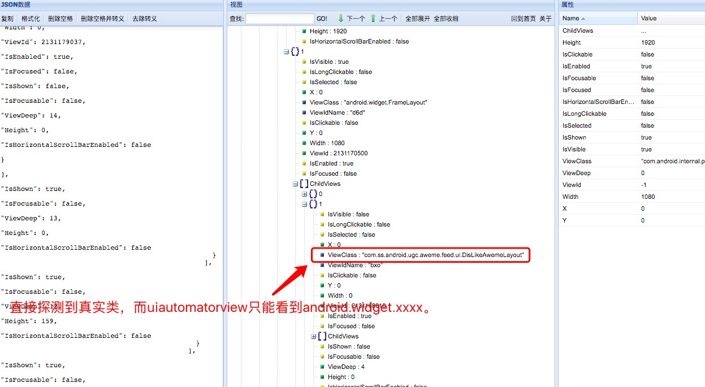
此ViewTree结果参考[viewTree.json](com.ss.android.ugc.aweme/viewTree.json "viewTree.json")


## 远程frida支持
在hooker根目录有一个.hooker_driver文件，内容默认是-U表示通过usb连接frida-server。
```shell
stephen@ubuntu:~/hooker$ cat .hooker_driver 
-U
```
如果你的frida-server绑定在0.0.0.0:27042，并且你需要远程连接的话。你需要知晓你的手机局域网ip比如是192.168.0.105，则把.hooker_driver改为如下内容即可实现hooker全局远程调试。
```shell
stephen@ubuntu:~/hooker$ cat .hooker_driver 
-H 192.168.0.105:27042
```


# 更新教程
hooker没有版本的概念，更新可以采用两种方式。建议每周一更，更新步骤建议采用如下操作顺序

### 1. clone最新项目
```shell
git clone https://github.com/CreditTone/hooker.git
```
如果git clone比较慢，你可以下载文件解压https://github.com/CreditTone/hooker/archive/refs/heads/master.zip

### 2. 方式一覆盖核心文件到你的hooker
此种方式适用于你有自己的hooker本地仓库，所以只覆盖最新hooker的核心功能文件是便于你管理自己的hooker的。
执行以下命令将核心文件覆盖到你本地的hooker

```shell
export LATEST_HOOKER=~/Download/hooker #这里要设置你下载的最新hooker目录
export MY_HOOKER=~/hooker #这里要设置你的hooker目录

#上面两个环境变量改好之后，下面的命令可以照抄
cp -f $LATEST_HOOKER/hooker $MY_HOOKER/hooker
cp -f $LATEST_HOOKER/hooker.py $MY_HOOKER/hooker.py
cp -f $LATEST_HOOKER/radar.dex $MY_HOOKER/radar.dex
cp -f $LATEST_HOOKER/run_env.py $MY_HOOKER/run_env.py
cp -f $LATEST_HOOKER/xinitdeploy.py $MY_HOOKER/xinitdeploy.py
cp -f $LATEST_HOOKER/spider.py $MY_HOOKER/spider.py
cp -f $LATEST_HOOKER/colorful.py $MY_HOOKER/colorful.py
cp -f $LATEST_HOOKER/requirements.txt $MY_HOOKER/requirements.txt
cp -rf $LATEST_HOOKER/js/* $MY_HOOKER/js/
cp -rf $LATEST_HOOKER/mobile-deploy/* $MY_HOOKER/mobile-deploy/
```
### 3. 方式二覆盖你的应用工作目录到最新hooker
如果你不需要维护自己的hooker版本，就可以用这个方式。简单粗暴！

```shell
export LATEST_HOOKER=~/Download/hooker #这里要设置你下载的最新hooker目录
export MY_HOOKER=~/hooker #这里要设置你的hooker目录

#你有多少个目录就拷贝多少个吧
cp -rf $MY_HOOKER/{your_app_package} $LATEST_HOOKER/ 
```

hooker实战应用
=================

### ssl_log链路层离线抓包

### objectId的深度理解和灵活应用
https://bbs.pediy.com/thread-267245.htm

### 内存漫游窥视对象内部数据
https://bbs.pediy.com/thread-267245.htm

### 亲测好用的脱壳工具
https://github.com/CodingGay/BlackDex

https://github.com/GuoQiang1993/Frida-Apk-Unpack

https://github.com/hanbinglengyue/FART

### 通信降级案例（亲测有效）
https://blog.csdn.net/qq314000558/article/details/105958847


### End
[1]: https://github.com/frida/frida "frida"
