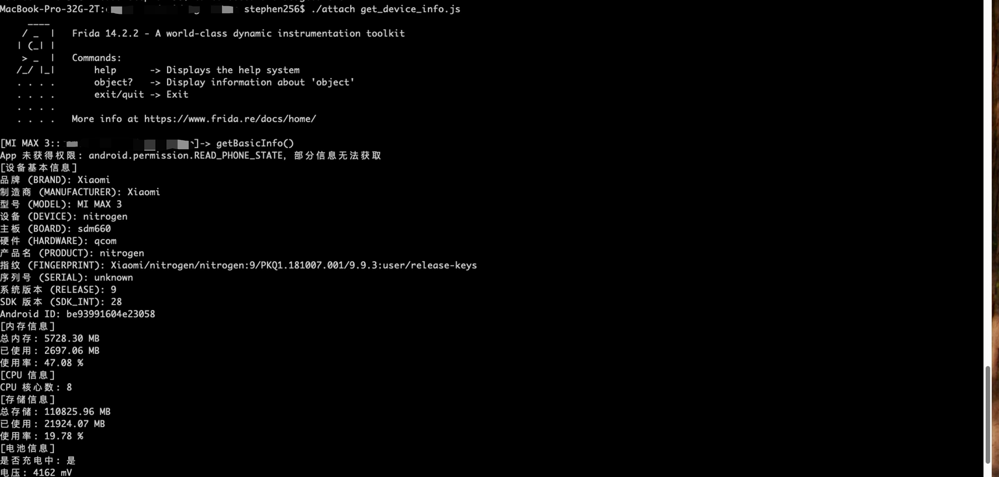
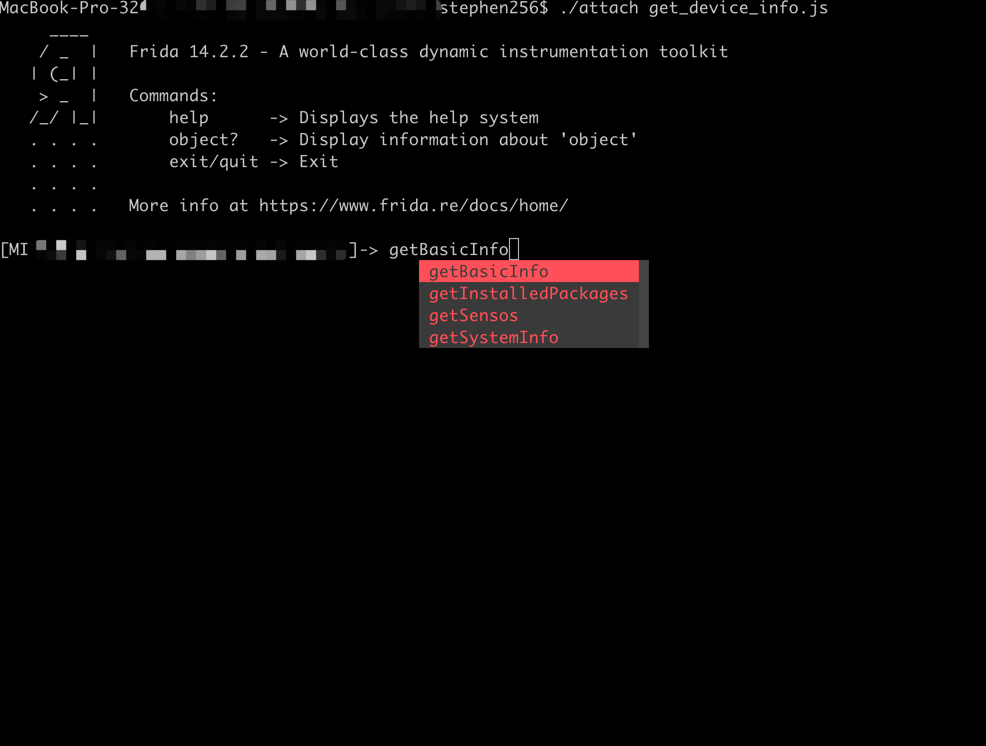

免责声明
本项目的所有内容仅供学习与技术交流使用，旨在帮助开发者理解移动应用的结构和工作原理。

本项目不包含任何针对特定应用的破解操作或侵权内容。
针对某些app存在的简单解包技术内容在各大技术论坛网站均大量存在，并无对这些app造成实际损害
本项目无意协助任何非法用途，包括但不限于绕过版权保护、修改应用功能或获取未经授权的数据。
请确保在使用本项目工具时遵守相关法律法规，并仅用于个人学习或研究目的。

<p>简体中文 | <a href="README.md">English</a></p>

# 欢迎使用hooker逆向工作台


hooker是一个基于frida实现的逆向工具包。旨在为安卓逆向开发人员提供一个舒适的命令行界面和一些常用的通杀脚本、自动化生成hook脚本、内存漫游探测activity和service、frida版JustTrustMe、boringssl unpinning全网app通杀

一张图证明你需要hooker


目录
=================

* [快速开始](#快速开始)
    * [1. git clone项目](#1-git-clone项目)
    * [2. 安装依赖](#2-安装python3依赖)
    * [3. root手机usb连接](#3-root手机usb连接PC)
    * [4. 启动hooker](#4-启动hooker)
    * [5. 输入调试应用包名](#5-输入调试应用包名)
    * [6. 查看help信息](#6-查看help信息)
    * [7. 生成指定类方法frida脚本](#7-生成指定类方法frida脚本)
    * [8. 查看当前所有frida脚本](#8-查看当前所有frida脚本)
    * [9. attach执行指定frida脚本](#9-attach执行指定frida脚本)
    * [10. 为app设置一个socks5代理](#10-为app设置一个socks5代理)
    * [11. 执行justtrustme kill掉所有ssl验证（包括boringgssl）](#11-执行justtrustme-kill掉所有ssl验证包括boringgssl)
    * [12. spawn执行指定frida脚本](#12-spawn执行指定frida脚本)
    * [13. 取消代理设置](#13-取消代理设置)
    * [14. 重启app](#14-重启app)
    * [15. 获取uid和pid](#15-获取uid和pid)
    
    


# 快速开始

手机保证root，无需任何手动启动frida-server等一切配置，hooker会帮你搞定一切

### 1. git clone项目
```shell
stephen@ubuntu:~$ git clone https://github.com/CreditTone/hooker.git
stephen@ubuntu:~$ cd hooker
```

### 2. 安装python3依赖
```shell
stephen@ubuntu:~/hooker$ pip3 install -r requirements.txt
```


### 3. root手机usb连接PC
```shell
stephen@ubuntu:~/hooker$ adb devices
List of devices attached
FA77C0301476	device
```


### 4. 启动hooker
```shell
stephen@ubuntu:~/hooker$ python3 hooker.py
bogon:hooker stephen256$ ./hooker.py
hooker Let's enjoy reverse engineering together
-----------------------------------------------------------------------------------------------
PID   	APP                 	IDENTIFIER                         	EXIST_REVERSE_DIRECTORY
0     	全球上网            	com.miui.virtualsim                	❌
0     	爱奇艺              	com.qiyi.video                     	❌
0     	红手指云手机        	com.redfinger.app                  	❌
0     	Reqable             	com.reqable.android                	❌
0     	美团                	com.sankuai.meituan                	✅
0     	得物                	com.shizhuang.duapp                	❌
0     	某皮           	     cxm.shxpxx.sg                      	✅
0     	微博                	com.sina.weibo                     	❌
0     	今日头条            	com.ss.android.article.news        	✅
0     	西瓜视频            	com.ss.android.article.video       	✅
0     	懂车帝              	com.ss.android.auto                	✅
0     	抖音火山版          	com.ss.android.ugc.live            	✅
0     	抖音精选            	com.ss.android.yumme.video         	❌
0     	淘宝                	com.taobao.taobao                  	✅
0     	腾讯视频            	com.tencent.qqlive                 	❌
0     	Termux              	com.termux                         	❌
0     	轻奢                	com.tm.bachelorparty               	✅
0     	WiFi ADB            	com.ttxapps.wifiadb                	❌
0     	VMOS Pro            	com.vmos.pro                       	✅
0     	游戏中心            	com.xiaomi.gamecenter              	❌
0     	小米商城            	com.xiaomi.shop                    	❌
0     	米家                	com.xiaomi.smarthome               	❌
0     	小米有品            	com.xiaomi.youpin                  	✅
0     	小红书              	com.xingin.xhs                     	✅
0     	运满满货主          	com.xiwei.logistics.consignor      	✅
0     	拼多多              	com.xunmeng.pinduoduo              	✅
0     	EnvCheck            	com.yimian.envcheck                	✅
0     	check_env           	com.yuuki.check_env                	❌
0     	TikTok              	com.zhiliaoapp.musically           	❌
0     	XPrivacyLua         	eu.faircode.xlua                   	❌
0     	imToken             	im.token.app                       	❌
0     	SocksDroid          	net.typeblog.socks                 	❌
0     	F-Droid             	org.fdroid.fdroid                  	❌
0     	ProxyDroid          	org.proxydroid                     	❌
3457  	手机管家            	com.miui.securitycenter            	✅
3509  	优信拍              	com.uxin.buyerphone                	✅
18780 	抖音                	com.ss.android.ugc.aweme           	✅
20174 	应用商店            	com.xiaomi.market                  	❌
20913 	设置                	com.android.settings               	❌
30500 	小爱同学            	com.miui.voiceassist               	❌
32163 	相机                	com.android.camera                 	✅
Please enter the identifier that needs to be reversed
hooker(Identifier):
```
***


### 5. 输入调试应用包名
```shell
hooker(Identifier): cxm.shxpxx.sg
✅ App cxm.shxpxx.sg is already in the foreground
Creating working directory: cxm.shxpxx.sg
Generating frida shortcut command...
Generating built-in frida script...
pull /data/app/cxm.shxpxx.sg-L8zkrpFVICv0-hOrtmPPxA==/base.apk to cxm.shxpxx.sg/ShopeeSG_3.43.40.apk successful
Working directory create successful
just_trust_me.js                                 empty.js                                         keystore_dump.js
edit_text.js                                     activity_events.js                               find_boringssl_custom_verify_func.js
ssl_log.js                                       hook_register_natives.js                         click.js
get_device_info.js                               apk_shell_scanner.js                             dump_dex.js
object_store.js                                  hook_artmethod_register.js                       replace_dlsym_get_pthread_create.js
just_trust_me_for_ios.js                         trace_initproc.js                                android_ui.js
hook_jni_method_trace.js                         url.js                                           just_trust_me_okhttp_hook_finder_for_android.js
text_view.js                                     find_anit_frida_so.js
某皮 > 
```

***


### 6. 查看help信息

```shell
某皮 > help
h, help                                      show this help message
a, activitys                                 show the activity stack
s, services                                  show the service stack
o, object [object_id]                        show object info by object_id
v, view [view_id]                            show view info by view_id of view
gs, generatescript [class_name:method_name]  specify the class name and method name to generate a frida hook java script file. For example: generatescript
                                             okhttp3.Request$Builder:addHeader
p, proxy [socks5_proxy_server]               set up a socks5 proxy for this app. For example: proxy socks5://192.168.0.100:9998
up, unproxy                                  remove socks5 proxy for this app
trust, justtrustme                           quickly spawn just_trust_me.js script to kill all ssl pinning
ls                                           list all the frida scripts of the current app
attach [script_file_name]                    quickly execute a frida script, similar to executing the command "frida -U com.example.app -l xxx.js". For example: attach url.js
spawn [script_file_name]                     quickly spawn a frida script, similar to executing the command "frida -U -f -n com.example.app -l xxx.js". For example: spawn
                                             just_trust_me.js
restart                                      restart this app
pid                                          get pid of this app main process
uid                                          get pid of this app
exit                                         return to the previous level
某皮 > 
```

***


### 7. 生成指定类方法frida脚本

- Command语法：gs, generatescript [class_name:method_name]


- 7.1 生成指定方法的frida hook脚本：
gs okhttp3.Request$Builder:addHeader，参数部分(String, String)不是必须写的

```shell
某信拍 > gs okhttp3.Request$Builder:addHeader(String, String)
Generating frida script, please wait for a few seconds
frida hook script: okhttp3.Request.Builder.addHeader.js
某信拍 > 
```

```js
//cat okhttp3.Request.Builder.addHeader.js
Java.perform(function() {
    var okhttp3_Request_Builder_clz = Java.use('okhttp3.Request$Builder');
    var okhttp3_Request_Builder_clz_method_addHeader_2grl = okhttp3_Request_Builder_clz.addHeader.overload('java.lang.String', 'java.lang.String');
    okhttp3_Request_Builder_clz_method_addHeader_2grl.implementation = function(string, string_x2) {
        var executor = this.hashCode();
        var beatText = 'public okhttp3.Request$Builder okhttp3.Request$Builder.addHeader(java.lang.String,java.lang.String)';
        var beat = newMethodBeat(beatText, executor);
        var ret = okhttp3_Request_Builder_clz_method_addHeader_2grl.call(this, string, string_x2);
        console.log("header name:" + string + " header value:" + string_x2);
        printBeat(beat);
        return ret;
    };
});
```
***


- 7.2 生成指定类的所有成员方法的frida hook脚本：
gs okhttp3.Request$Builder

```shell
某信拍 > generatescript okhttp3.Request$Builder
Generating frida script, please wait for a few seconds
frida hook script: okhttp3.Request.Builder.allfunc.js
```
***

```js
//cat okhttp3.Request.Builder.allfunc.js
//okhttp3.Request$Builder
Java.perform(function() {
    var okhttp3_Request_Builder_clz = Java.use('okhttp3.Request$Builder');
    var okhttp3_Request_Builder_clz_method_header_ng3n = okhttp3_Request_Builder_clz.header.overload('java.lang.String', 'java.lang.String');
    okhttp3_Request_Builder_clz_method_header_ng3n.implementation = function(string, string_x2) {
        var executor = this.hashCode();
        var beatText = 'public okhttp3.Request$Builder okhttp3.Request$Builder.header(java.lang.String,java.lang.String)';
        var beat = newMethodBeat(beatText, executor);
        var ret = okhttp3_Request_Builder_clz_method_header_ng3n.call(this, string, string_x2);
        printBeat(beat);
        return ret;
    };
    var okhttp3_Request_Builder_clz_method_cacheControl_q8q5 = okhttp3_Request_Builder_clz.cacheControl.overload('okhttp3.CacheControl');
    okhttp3_Request_Builder_clz_method_cacheControl_q8q5.implementation = function(cacheControl) {
        var executor = this.hashCode();
        var beatText = 'public okhttp3.Request$Builder okhttp3.Request$Builder.cacheControl(okhttp3.CacheControl)';
        var beat = newMethodBeat(beatText, executor);
        var ret = okhttp3_Request_Builder_clz_method_cacheControl_q8q5.call(this, cacheControl);
        printBeat(beat);
        return ret;
    };
    var okhttp3_Request_Builder_clz_method_method_bjk9 = okhttp3_Request_Builder_clz.method.overload('java.lang.String', 'okhttp3.RequestBody');
    okhttp3_Request_Builder_clz_method_method_bjk9.implementation = function(string, requestBody) {
        var executor = this.hashCode();
        var beatText = 'public okhttp3.Request$Builder okhttp3.Request$Builder.method(java.lang.String,okhttp3.RequestBody)';
        var beat = newMethodBeat(beatText, executor);
        var ret = okhttp3_Request_Builder_clz_method_method_bjk9.call(this, string, requestBody);
        printBeat(beat);
        return ret;
    };
    var okhttp3_Request_Builder_clz_method_head_a5nq = okhttp3_Request_Builder_clz.head.overload();
    okhttp3_Request_Builder_clz_method_head_a5nq.implementation = function() {
        var executor = this.hashCode();
        var beatText = 'public okhttp3.Request$Builder okhttp3.Request$Builder.head()';
        var beat = newMethodBeat(beatText, executor);
        var ret = okhttp3_Request_Builder_clz_method_head_a5nq.call(this);
        printBeat(beat);
        return ret;
    };
    var okhttp3_Request_Builder_clz_method_headers_to5i = okhttp3_Request_Builder_clz.headers.overload('okhttp3.Headers');
    okhttp3_Request_Builder_clz_method_headers_to5i.implementation = function(headers) {
        var executor = this.hashCode();
        var beatText = 'public okhttp3.Request$Builder okhttp3.Request$Builder.headers(okhttp3.Headers)';
        var beat = newMethodBeat(beatText, executor);
        var ret = okhttp3_Request_Builder_clz_method_headers_to5i.call(this, headers);
        printBeat(beat);
        return ret;
    };
    var okhttp3_Request_Builder_clz_method_post_heaq = okhttp3_Request_Builder_clz.post.overload('okhttp3.RequestBody');
    okhttp3_Request_Builder_clz_method_post_heaq.implementation = function(requestBody) {
        var executor = this.hashCode();
        var beatText = 'public okhttp3.Request$Builder okhttp3.Request$Builder.post(okhttp3.RequestBody)';
        var beat = newMethodBeat(beatText, executor);
        var ret = okhttp3_Request_Builder_clz_method_post_heaq.call(this, requestBody);
        printBeat(beat);
        return ret;
    };
    var okhttp3_Request_Builder_clz_method_build_rmqx = okhttp3_Request_Builder_clz.build.overload();
    okhttp3_Request_Builder_clz_method_build_rmqx.implementation = function() {
        var executor = this.hashCode();
        var beatText = 'public okhttp3.Request okhttp3.Request$Builder.build()';
        var beat = newMethodBeat(beatText, executor);
        var ret = okhttp3_Request_Builder_clz_method_build_rmqx.call(this);
        printBeat(beat);
        return ret;
    };
    var okhttp3_Request_Builder_clz_method_patch_hp9u = okhttp3_Request_Builder_clz.patch.overload('okhttp3.RequestBody');
    okhttp3_Request_Builder_clz_method_patch_hp9u.implementation = function(requestBody) {
        var executor = this.hashCode();
        var beatText = 'public okhttp3.Request$Builder okhttp3.Request$Builder.patch(okhttp3.RequestBody)';
        var beat = newMethodBeat(beatText, executor);
        var ret = okhttp3_Request_Builder_clz_method_patch_hp9u.call(this, requestBody);
        printBeat(beat);
        return ret;
    };
    var okhttp3_Request_Builder_clz_method_url_0owi = okhttp3_Request_Builder_clz.url.overload('java.lang.String');
    okhttp3_Request_Builder_clz_method_url_0owi.implementation = function(string) {
        var executor = this.hashCode();
        var beatText = 'public okhttp3.Request$Builder okhttp3.Request$Builder.url(java.lang.String)';
        var beat = newMethodBeat(beatText, executor);
        var ret = okhttp3_Request_Builder_clz_method_url_0owi.call(this, string);
        printBeat(beat);
        return ret;
    };
    var okhttp3_Request_Builder_clz_method_removeHeader_uzb9 = okhttp3_Request_Builder_clz.removeHeader.overload('java.lang.String');
    okhttp3_Request_Builder_clz_method_removeHeader_uzb9.implementation = function(string) {
        var executor = this.hashCode();
        var beatText = 'public okhttp3.Request$Builder okhttp3.Request$Builder.removeHeader(java.lang.String)';
        var beat = newMethodBeat(beatText, executor);
        var ret = okhttp3_Request_Builder_clz_method_removeHeader_uzb9.call(this, string);
        printBeat(beat);
        return ret;
    };
    var okhttp3_Request_Builder_clz_method_url_ykbd = okhttp3_Request_Builder_clz.url.overload('java.net.URL');
    okhttp3_Request_Builder_clz_method_url_ykbd.implementation = function(url) {
        var executor = this.hashCode();
        var beatText = 'public okhttp3.Request$Builder okhttp3.Request$Builder.url(java.net.URL)';
        var beat = newMethodBeat(beatText, executor);
        var ret = okhttp3_Request_Builder_clz_method_url_ykbd.call(this, url);
        printBeat(beat);
        return ret;
    };
    var okhttp3_Request_Builder_clz_method_delete_dqyl = okhttp3_Request_Builder_clz.delete.overload();
    okhttp3_Request_Builder_clz_method_delete_dqyl.implementation = function() {
        var executor = this.hashCode();
        var beatText = 'public okhttp3.Request$Builder okhttp3.Request$Builder.delete()';
        var beat = newMethodBeat(beatText, executor);
        var ret = okhttp3_Request_Builder_clz_method_delete_dqyl.call(this);
        printBeat(beat);
        return ret;
    };
    //.......省略N行代码
```
***


- 7.3 生成指定类的构造方法的frida hook脚本：
gs okhttp3.Request$Builder:_ 或者gs okhttp3.Request$Builder:\<init\>

```shell
某信拍 > gs okhttp3.Request$Builder:<init>()
Generating frida script, please wait for a few seconds
frida hook script: okhttp3.Request.Builder._init.js
```

```js
//cat okhttp3.Request.Builder._init.js
//okhttp3.Request$Builder:<init>()
Java.perform(function() {
    var okhttp3_Request_Builder_clz = Java.use('okhttp3.Request$Builder');
    var okhttp3_Request_Builder_clz_init_uw3i = okhttp3_Request_Builder_clz.$init.overload();
    okhttp3_Request_Builder_clz_init_uw3i.implementation = function() {
        var executor = this.hashCode();
        var beatText = 'public okhttp3.Request$Builder()';
        var beat = newMethodBeat(beatText, executor);
        var returnObj = okhttp3_Request_Builder_clz_init_uw3i.call(this);
        printBeat(beat);
        return returnObj;
    };
    var okhttp3_Request_Builder_clz_init_e58t = okhttp3_Request_Builder_clz.$init.overload('okhttp3.Request');
    okhttp3_Request_Builder_clz_init_e58t.implementation = function(v0) {
        var executor = this.hashCode();
        var beatText = 'okhttp3.Request$Builder(okhttp3.Request)';
        var beat = newMethodBeat(beatText, executor);
        var returnObj = okhttp3_Request_Builder_clz_init_e58t.call(this, v0);
        printBeat(beat);
        return returnObj;
    };
});
```
***


### 8. 查看当前所有frida脚本
```shell
某皮 > ls
just_trust_me.js                                 empty.js                                         keystore_dump.js
okhttp3.Request.Builder.addHeader.js             edit_text.js                                     activity_events.js
find_boringssl_custom_verify_func.js             ssl_log.js                                       hook_register_natives.js
click.js                                         get_device_info.js                               apk_shell_scanner.js
dump_dex.js                                      object_store.js                                  hook_artmethod_register.js
replace_dlsym_get_pthread_create.js              just_trust_me_for_ios.js                         trace_initproc.js
android_ui.js                                    hook_jni_method_trace.js                         url.js
just_trust_me_okhttp_hook_finder_for_android.js  text_view.js                                     find_anit_frida_so.js
某皮 >
```
***

### 9. attach执行指定frida脚本
```shell
某信拍 > attach url.js
------------startFlag:0755liv1,objectHash:-915348569,thread(id:810,name:Wmda.EventUploadThread),timestamp:1747836814835---------------
url:https://apiwmxx.xxx.com.cn/report/c?api_v=3&sdk_v=1.7.0.0&timestamp=1747836814832&appid=17591177894321&p=2&uuid=248056262e0030b7bb56c0f9237f846d
public java.net.URL(String)
	at java.net.URL.<init>(Native Method)
	at com.wxbx.wmda.e.b.a(SourceFile:5)
	at com.wxbx.wmda.e.b.a(SourceFile:1)
	at com.wxbx.wmda.h.a.a(SourceFile:162)
	at com.wxbx.wmda.h.a.b(SourceFile:19)
	at com.wxbx.wmda.h.a.a(SourceFile:2)
	at com.wxbx.wmda.h.a$b.handleMessage(SourceFile:3)
	at android.os.Handler.dispatchMessage(Handler.java:106)
	at android.os.Looper.loop(Looper.java:201)
	at android.os.HandlerThread.run(HandlerThread.java:65)
------------endFlag:0755liv1,usedtime:1---------------

------------startFlag:1ps6go99,objectHash:-237375819,thread(id:810,name:Wmda.EventUploadThread),timestamp:1747836815192---------------
url:https://apiwmxx.xxx.com.cn/report/c?api_v=3&sdk_v=1.7.0.0&timestamp=1747836815188&appid=17591177894321&p=2&uuid=248056262e0030b7bb56c0f9237f846d
public java.net.URL(String)
	at java.net.URL.<init>(Native Method)
	at com.android.okhttp.HttpUrl.url(HttpUrl.java:327)
	at com.android.okhttp.Request.url(Request.java:53)
	at com.android.okhttp.Request$Builder.build(Native Method)
	at com.android.okhttp.internal.huc.HttpURLConnectionImpl.newHttpEngine(HttpURLConnectionImpl.java:377)
	at com.android.okhttp.internal.huc.HttpURLConnectionImpl.initHttpEngine(HttpURLConnectionImpl.java:332)
	at com.android.okhttp.internal.huc.HttpURLConnectionImpl.connect(HttpURLConnectionImpl.java:124)
	at com.android.okhttp.internal.huc.HttpURLConnectionImpl.getOutputStream(HttpURLConnectionImpl.java:258)
	at com.android.okhttp.internal.huc.DelegatingHttpsURLConnection.getOutputStream(DelegatingHttpsURLConnection.java:218)
	at com.android.okhttp.internal.huc.HttpsURLConnectionImpl.getOutputStream(HttpsURLConnectionImpl.java:26)
	at com.wxbx.wmda.e.b.a(SourceFile:14)
	at com.wxbx.wmda.e.b.a(SourceFile:1)
	at com.wxbx.wmda.h.a.a(SourceFile:162)
	at com.wxbx.wmda.h.a.b(SourceFile:19)
	at com.wxbx.wmda.h.a.a(SourceFile:2)
	at com.wxbx.wmda.h.a$b.handleMessage(SourceFile:3)
	at android.os.Handler.dispatchMessage(Handler.java:106)
	at android.os.Looper.loop(Looper.java:201)
	at android.os.HandlerThread.run(HandlerThread.java:65)
------------endFlag:1ps6go99,usedtime:0---------------
// 这里省略无数日志.............
------------startFlag:i7osxvjl,objectHash:134280600,thread(id:810,name:Wmda.EventUploadThread),timestamp:1747836815193---------------
url:https://apiwmxx.xxx.com.cn/report/c?api_v=3&sdk_v=1.7.0.0&timestamp=1747836815188&appid=17591177894321&p=2&uuid=248056262e0030b7bb56c0f9237f846d
com.android.okhttp.Request.Builder.build()
	at com.android.okhttp.Request$Builder.build(Native Method)
	at com.android.okhttp.internal.huc.HttpURLConnectionImpl.newHttpEngine(HttpURLConnectionImpl.java:377)
	at com.android.okhttp.internal.huc.HttpURLConnectionImpl.initHttpEngine(HttpURLConnectionImpl.java:332)
	at com.android.okhttp.internal.huc.HttpURLConnectionImpl.connect(HttpURLConnectionImpl.java:124)
	at com.android.okhttp.internal.huc.HttpURLConnectionImpl.getOutputStream(HttpURLConnectionImpl.java:258)
	at com.android.okhttp.internal.huc.DelegatingHttpsURLConnection.getOutputStream(DelegatingHttpsURLConnection.java:218)
	at com.android.okhttp.internal.huc.HttpsURLConnectionImpl.getOutputStream(HttpsURLConnectionImpl.java:26)
	at com.wxbx.wmda.e.b.a(SourceFile:14)
	at com.wxbx.wmda.e.b.a(SourceFile:1)
	at com.wxbx.wmda.h.a.a(SourceFile:162)
	at com.wxbx.wmda.h.a.b(SourceFile:19)
	at com.wxbx.wmda.h.a.a(SourceFile:2)
	at com.wxbx.wmda.h.a$b.handleMessage(SourceFile:3)
	at android.os.Handler.dispatchMessage(Handler.java:106)
	at android.os.Looper.loop(Looper.java:201)
	at android.os.HandlerThread.run(HandlerThread.java:65)
------------endFlag:i7osxvjl,usedtime:1---------------
// 这里省略无数日志.............
```
***

### 10. 为app设置一个socks5代理
```shell
某音 > proxy socks5://10.112.99.11:9998
proxy socks5://10.112.99.11:9998 OK
某音 > 
```
***


### 11. 执行justtrustme kill掉所有ssl验证（包括boringgssl）

```shell
某音 > justtrustme
Package name: com.ss.xxxx.xxx.aweme
android.security.net.config.NetworkSecurityTrustManager.checkPins('java.util.List') was hooked!
android.security.net.config.NetworkSecurityTrustManager.checkPins('java.util.List') was hooked!
android.security.net.config.NetworkSecurityTrustManager.checkPins('java.util.List') was hooked!
android.security.net.config.NetworkSecurityTrustManager.checkPins('java.util.List') was hooked!
javax.net.ssl.TrustManagerFactory.getTrustManagers() was hooked!
javax.net.ssl.SSLContext.init('[Ljavax.net.ssl.KeyManager;', '[Ljavax.net.ssl.TrustManager;', 'java.security.SecureRandom') was hooked!
javax.net.ssl.TrustManagerFactory.getTrustManagers() was hooked!
javax.net.ssl.SSLContext.init('[Ljavax.net.ssl.KeyManager;', '[Ljavax.net.ssl.TrustManager;', 'java.security.SecureRandom') was hooked!
javax.net.ssl.TrustManagerFactory.getTrustManagers() was hooked!
javax.net.ssl.SSLContext.init('[Ljavax.net.ssl.KeyManager;', '[Ljavax.net.ssl.TrustManager;', 'java.security.SecureRandom') was hooked!
javax.net.ssl.SSLContext.init('[Ljavax.net.ssl.KeyManager;', '[Ljavax.net.ssl.TrustManager;', 'java.security.SecureRandom') was hooked!
static void com.android.org.conscrypt.Platform.checkServerTrusted(javax.net.ssl.X509TrustManager,java.security.cert.X509Certificate[],java.lang.String,com.android.org.conscrypt.AbstractConscryptSocket) throws java.security.cert.CertificateException was hooked!
static void com.android.org.conscrypt.Platform.checkServerTrusted(javax.net.ssl.X509TrustManager,java.security.cert.X509Certificate[],java.lang.String,com.android.org.conscrypt.AbstractConscryptSocket) throws java.security.cert.CertificateException was hooked!
static void com.android.org.conscrypt.Platform.checkServerTrusted(javax.net.ssl.X509TrustManager,java.security.cert.X509Certificate[],java.lang.String,com.android.org.conscrypt.AbstractConscryptSocket) throws java.security.cert.CertificateException was hooked!
static void com.android.org.conscrypt.Platform.checkServerTrusted(javax.net.ssl.X509TrustManager,java.security.cert.X509Certificate[],java.lang.String,com.android.org.conscrypt.AbstractConscryptSocket) throws java.security.cert.CertificateException was hooked!
okhttp3.internal.tls.OkHostnameVerifier.verify('java.lang.String', 'javax.net.ssl.SSLSession') was hooked!
okhttp3.CertificatePinner.check('java.lang.String', 'java.util.List') was hooked!
static void com.android.org.conscrypt.Platform.checkServerTrusted(javax.net.ssl.X509TrustManager,java.security.cert.X509Certificate[],java.lang.String,com.android.org.conscrypt.AbstractConscryptSocket) throws java.security.cert.CertificateException was hooked!
static void com.android.org.conscrypt.Platform.checkServerTrusted(javax.net.ssl.X509TrustManager,java.security.cert.X509Certificate[],java.lang.String,com.android.org.conscrypt.AbstractConscryptSocket) throws java.security.cert.CertificateException was hooked!
okhttp3.internal.tls.OkHostnameVerifier.verify('java.lang.String', 'javax.net.ssl.SSLSession') was hooked!
okhttp3.CertificatePinner.check('java.lang.String', 'java.util.List') was hooked!
okhttp3.internal.tls.OkHostnameVerifier.verify('java.lang.String', 'javax.net.ssl.SSLSession') was hooked!
okhttp3.internal.tls.OkHostnameVerifier.verify('java.lang.String', 'javax.net.ssl.SSLSession') was hooked!
okhttp3.internal.tls.OkHostnameVerifier.verify('java.lang.String', 'javax.net.ssl.SSLSession') was hooked!
okhttp3.CertificatePinner.check('java.lang.String', 'java.util.List') was hooked!
okhttp3.CertificatePinner.check('java.lang.String', 'java.util.List') was hooked!
okhttp3.CertificatePinner.check('java.lang.String', 'java.util.List') was hooked!
static void com.android.org.conscrypt.Platform.checkServerTrusted(javax.net.ssl.X509TrustManager,java.security.cert.X509Certificate[],java.lang.String,com.android.org.conscrypt.AbstractConscryptSocket) throws java.security.cert.CertificateException was hooked!
okhttp3.internal.tls.OkHostnameVerifier.verify('java.lang.String', 'javax.net.ssl.SSLSession') was hooked!
okhttp3.CertificatePinner.check('java.lang.String', 'java.util.List') was hooked!
okhttp3.CertificatePinner.check('java.lang.String', 'java.util.List') was hooked!
okhttp3.CertificatePinner.check('java.lang.String', 'java.util.List') was hooked!
// 这里省略无数日志.............
```
***


### 12. spawn执行指定frida脚本
```shell
某信拍 > spawn just_trust_me.js
Package name: com.xxx.buyxxphone
javax.net.ssl.SSLContext.init('[Ljavax.net.ssl.KeyManager;', '[Ljavax.net.ssl.TrustManager;', 'java.security.SecureRandom') was hooked!
javax.net.ssl.TrustManagerFactory.getTrustManagers() was hooked!
javax.net.ssl.SSLContext.init('[Ljavax.net.ssl.KeyManager;', '[Ljavax.net.ssl.TrustManager;', 'java.security.SecureRandom') was hooked!
// 这里省略无数日志.............
```
***


### 13. 取消代理设置
```shell
某音 > unproxy
unproxy OK
某音 > 
```
***


### 14. 重启app

```shell
某信拍 > restart
restarts com.xxx.buyxxphone
```
***


### 15. 获取uid和pid
```shell
某信拍 > uid
10189
某信拍 > pid
3509
```
***

# 应用目录通杀脚本

### url.js
跟踪所有url生成
frida url.js


### 2. activity_events.js
当你需要跟踪start某个Activity启动时可执行，获取startActivity的intent信息和调用堆栈。/hooking activity_events.js


### 3. click.js
跟踪点击事件时可执行，并获取被点击View的真实VClass（很重要）。获取到了Class，你就可以在jadx找到这个View绑定事件代码。多一种办法定位到关键逻辑不好吗？一定要靠分析网络请求吗？条条大路通罗马，不一定非从网络库分析！ /hooking click.js


### 4. android_ui.js
封装一些操作原生Android UI的函数。如startActivity(activityName)、home()、back()、finishCurrentActivity()、clickByText(text) 等等，命令使用得用attach './attach android_ui.js' 原理是借助radar.dex作为代理操作Android原生View。（tag）

***

### 5. keystore_dump.js
在https双向认证的情况下，dump客户端证书为p12。存储位置:/data/user/0/{packagename}/client_keystore_{nowtime}.p12 证书密码: hooker。原理是hook java.security.KeyStore的getPrivateKey和getCertificate方法，因为客户端向服务发送证书必调这个方法。强烈建议keystore_dump.js用spawn模式启动，启动命令为 ./spawn keystore_dump.js 。下面是某app双向认证dump客户端证书过程


### 6. edit_text.js
跟踪获取Editview的getText()事件，并获取Editview的真实Class（很重要）。Editview一般绑定Search Action的实现代码，如果你抓取“搜索”接口。那么这个一定可以帮助你定位发送搜索请求的相关代码。多一种办法定位到关键逻辑不好吗？一定要靠分析网络请求吗？条条大路通罗马，不一定非从网络库分析！


### 7. text_view.js
跟踪TextView的setText和getText，获取TextView的真实Class。一般setText的堆栈信息会带出业务层的数据model处理逻辑，进而进一步分析到业务层数据bean封装类。


### 8. ssl_log.js
在native层跟踪ssl握手并记录CLIENT RANDOM，tcpdump出来的链路层pacp里面的TLS包可以用CLIENT RANDOM记录文件解出来，将在高级篇讲解使用步骤。

### 9. object_store.js
操作ObjectId标识的对象，根据自身分析情况可进行特定的序列化打印、操作对象的私有成员变量。
实践文章：https://bbs.pediy.com/thread-267245.htm

### 10. hook_register_natives.js
对于动态注册的native函数，我们需要用hook_register_natives.js来分析。建议用spawn模式启动，启动命令为 ./spawn hook_register_natives.js
当hook_RN.js无法找到native函数时，试试[15. hook_artmethod_register.js](#15-hook_artmethod_registerjs)


### 11. just_trust_me.js
frida版本的just_trust_me，支持boringssl unpinning。执行./spawn just_trust_me.js

windowsn用户配置just_trust_me.js执行环境看[windows临时使用hooker js脚本方案](#6-windows临时使用hooker-js脚本方案)

下面以Twitter为例，启动just_trust_me.js
启动演示


抓包效果演示


### 13. trace_init_proc.js
init_proc的hook实现比较麻烦，这边给一个实现模版，你需要把脚本中init_proc函数的startAddr、endAddr补充上，somodule是你so的名字，这样你就可以trace init_proc了


### 14. dump_dex.js
执行./spawn dump_dex.js即可脱壳，针对大部分简单的壳可以脱。ART下引入了dex2oat来对dex进行编译，生成每一个java函数对应的native代码，来提高运行效率。有时候如果不能脱你需求删除/data/app/<package_name>-*/oat/arm64/目录下的所有文件再执行，如果还不能脱就gg了
```javascript
MacBook-Pro-32G-2T:com.shxpxx.sg stephen256$ ./spawn dump_dex.js
     ____
    / _  |   Frida 14.2.2 - A world-class dynamic instrumentation toolkit
   | (_| |
    > _  |   Commands:
   /_/ |_|       help      -> Displays the help system
   . . . .       object?   -> Display information about 'object'
   . . . .       exit/quit -> Exit
   . . . .
   . . . .   More info at https://www.frida.re/docs/home/
Spawning `com.shxpxx.sg`...
_ZN3art11ClassLinker11DefineClassEPNS_6ThreadEPKcmNS_6HandleINS_6mirror11ClassLoaderEEERKNS_7DexFileERKNS9_8ClassDefE 0x7521584e08
[DefineClass:] 0x7521584e08
Spawned `com.shxpxx.sg`. Resuming main thread!
[MI MAX 3::com.shxpxx.sg]-> [find dex]: /data/data/com.shxpxx.sg/files/dump_dex_com.shxpxx.sg/classes.dex
[dump dex]: /data/data/com.shxpxx.sg/files/dump_dex_com.shxpxx.sg/classes.dex
[find dex]: /data/data/com.shxpxx.sg/files/dump_dex_com.shxpxx.sg/classes2.dex
[dump dex]: /data/data/com.shxpxx.sg/files/dump_dex_com.shxpxx.sg/classes2.dex
[find dex]: /data/data/com.shxpxx.sg/files/dump_dex_com.shxpxx.sg/classes3.dex
[dump dex]: /data/data/com.shxpxx.sg/files/dump_dex_com.shxpxx.sg/classes3.dex
[find dex]: /data/data/com.shxpxx.sg/files/dump_dex_com.shxpxx.sg/classes4.dex
[dump dex]: /data/data/com.shxpxx.sg/files/dump_dex_com.shxpxx.sg/classes4.dex
[find dex]: /data/data/com.shxpxx.sg/files/dump_dex_com.shxpxx.sg/classes5.dex
[dump dex]: /data/data/com.shxpxx.sg/files/dump_dex_com.shxpxx.sg/classes5.dex
[find dex]: /data/data/com.shxpxx.sg/files/dump_dex_com.shxpxx.sg/classes6.dex
[dump dex]: /data/data/com.shxpxx.sg/files/dump_dex_com.shxpxx.sg/classes6.dex
[find dex]: /data/data/com.shxpxx.sg/files/dump_dex_com.shxpxx.sg/classes7.dex
[dump dex]: /data/data/com.shxpxx.sg/files/dump_dex_com.shxpxx.sg/classes7.dex
[find dex]: /data/data/com.shxpxx.sg/files/dump_dex_com.shxpxx.sg/classes8.dex
[dump dex]: /data/data/com.shxpxx.sg/files/dump_dex_com.shxpxx.sg/classes8.dex
[find dex]: /data/data/com.shxpxx.sg/files/dump_dex_com.shxpxx.sg/classes9.dex
[dump dex]: /data/data/com.shxpxx.sg/files/dump_dex_com.shxpxx.sg/classes9.dex
[find dex]: /data/data/com.shxpxx.sg/files/dump_dex_com.shxpxx.sg/classes10.dex
[dump dex]: /data/data/com.shxpxx.sg/files/dump_dex_com.shxpxx.sg/classes10.dex
```

### 15. hook_artmethod_register.js
有时候hook_RN.js无法hook到RegisterNatives方法，那是因为厂商直接自实现了RegisterNatives，方法下沉到了ArtMethod.RegisterNative方法
先执行./xinitdeploy将扩展的so部署到应用目录，再执行./spawn hook_artmethod_register.js hook ArtMethod RegisterNative

```shell
MacBook-Pro-32G-2T:com.shxpxx.sg stephen256$ ./xinitdeploy
copying libext64.so to path: /data/data/com.shxpxx.sg/libext64.so
copying libext.so to path: /data/data/com.shxpxx.sg/libext.so
deploying xinit finished.
MacBook-Pro-32G-2T:com.shxpxx.sg stephen256$ ./spawn hook_artmethod_register.js
     ____
    / _  |   Frida 14.2.2 - A world-class dynamic instrumentation toolkit
   | (_| |
    > _  |   Commands:
   /_/ |_|       help      -> Displays the help system
   . . . .       object?   -> Display information about 'object'
   . . . .       exit/quit -> Exit
   . . . .
   . . . .   More info at https://www.frida.re/docs/home/
Spawning `com.shxpxx.sg`...
ArtMethod::PrettyMethod is at  0x7521538e60 _ZN3art9ArtMethod12PrettyMethodEb
ArtMethod::RegisterNative is at  0x75215391b0 _ZN3art9ArtMethod14RegisterNativeEPKv
Spawned `com.shxpxx.sg`. Resuming main thread!
[MI MAX 3::com.shxpxx.sg]-> [ArtMethod_RegisterNative] Method_sig: int com.qualcomm.qti.Performance.native_perf_lock_acq(int, int, int[]) module_name: libqti_performance.so offset: 0x19f0
[ArtMethod_RegisterNative] Method_sig: int com.qualcomm.qti.Performance.native_perf_lock_rel(int) module_name: libqti_performance.so offset: 0x1abc
[ArtMethod_RegisterNative] Method_sig: int com.qualcomm.qti.Performance.native_perf_hint(int, java.lang.String, int, int) module_name: libqti_performance.so offset: 0x1ad8
[ArtMethod_RegisterNative] Method_sig: int com.qualcomm.qti.Performance.native_perf_get_feedback(int, java.lang.String) module_name: libqti_performance.so offset: 0x1b90
[ArtMethod_RegisterNative] Method_sig: int com.qualcomm.qti.Performance.native_perf_io_prefetch_start(int, java.lang.String, java.lang.String) module_name: libqti_performance.so offset: 0x1c24
[ArtMethod_RegisterNative] Method_sig: int com.qualcomm.qti.Performance.native_perf_io_prefetch_stop() module_name: libqti_performance.so offset: 0x1e58
[ArtMethod_RegisterNative] Method_sig: int com.qualcomm.qti.Performance.native_perf_uxEngine_events(int, int, java.lang.String, int) module_name: libqti_performance.so offset: 0x1f80
[ArtMethod_RegisterNative] Method_sig: java.lang.String com.qualcomm.qti.Performance.native_perf_uxEngine_trigger(int) module_name: libqti_performance.so offset: 0x2154
[ArtMethod_RegisterNative] Method_sig: void com.tencent.mmkv.MMKV.onExit() module_name: libmmkv.so offset: 0x1717c
[ArtMethod_RegisterNative] Method_sig: java.lang.String com.tencent.mmkv.MMKV.cryptKey() module_name: libmmkv.so offset: 0x17180
[ArtMethod_RegisterNative] Method_sig: boolean com.tencent.mmkv.MMKV.reKey(java.lang.String) module_name: libmmkv.so offset: 0x1727c
[ArtMethod_RegisterNative] Method_sig: void com.tencent.mmkv.MMKV.checkReSetCryptKey(java.lang.String) module_name: libmmkv.so offset: 0x17478
```

### 16. find_anit_frida_so.js
某些可恶的app会对frida进行反调试，用这个可以对反调试的so进行找出。原理是谁最后一个被加载，然后app出现了崩溃，谁就是坏人


### 17. hook_jni_method_trace.js
Native层调java时追踪一些方法，用于确定so层的调用栈，hook的地方比较多，打印有些凌乱，你需要根据自身需求精简打印和增加更多打印的信息

### 18. replace_dlsym_get_pthread_create.js
libmsaoaidsec.so版本有很多，而且在很多app中广泛存在。大致分为2类一个是通过got表导入了pthread_create函数创建了反调试线程，这个你直接去ida so搜索pthread_create函数NOP。第二是用dlsym动态加载libc.so库来获取pthread_create函数指针，这个我们直接用frida hook dlsym函数就可以劫持
我预计，将来厂商可能会下沉到svc或者通过其他so来启动线程，到那时候我们再说。这边先给了通用实现，专门用来对抗dlsym版本的libmsaoaidsec.so


### 19. find_boringssl_custom_verify_func.js
专门用于查找boringssl的验证函数，boringssl现在学聪明了，验证函数没有了之前的字符串特征。我们需要hook SSL_CTX_set_custom_verify把验证函数找出来，随后进行hook强制返回0。

执行./spawn find_boringssl_custom_verify_func.js 之前记得清除某音app所有的数据缓存，因为某些函数只会注册一次。


找到几个验证函数后，我们再实现hook验证函数强制返回0，如下


抓包效果


### 20. get_device_info.js
获取设备指纹信息，包括Android ID、IMEI、FINGERPRINT、已安装app、传感器、基带版本等等几十个设备指纹。用于当你想快速了解当前设备的指纹信息时使用
打开任意一个app，附加调试后进入到attch命令行模式
./attach get_device_info.js

这里有4个方法供你使用，输入任意一个方法即可获取相应信息
#### getBasicInfo()，获取基本设备信息 包括品牌、厂商、型号、主板、硬件、系统版本、内存信息、存储信息、电池信息、Android ID、IMEI、FINGERPRINT等
#### getInstalledPackages()，获取每个已安装apk的应用名称、包名、是否系统应用
#### getSensos()，获取每个传感器的名称、厂商、功耗、精度、最小延迟等
#### getSystemInfo()，获取是否已root、开机时长、Java运行时信息、内核信息、DRM信息



### 21. apk_shell_scanner.js
查壳脚本，动态识别加载的共享库（.so）或特征文件。支持多种主流壳类型，包括：娜迦、爱加密、爱加密企业版、梆梆免费版、梆梆企业版、360加固保、通付盾、网秦、百度加固、阿里聚安全、腾讯加固、腾讯御安全、网易易盾、APKProtect、几维安全、顶像科技、盛大加固、瑞星加固。

./attach apk_shell_scanner.js

如检测到壳将输出: This app is protected by {爱加密}.

如未检测到壳将输出：This app is not protected or uses an unknown protection scheme.