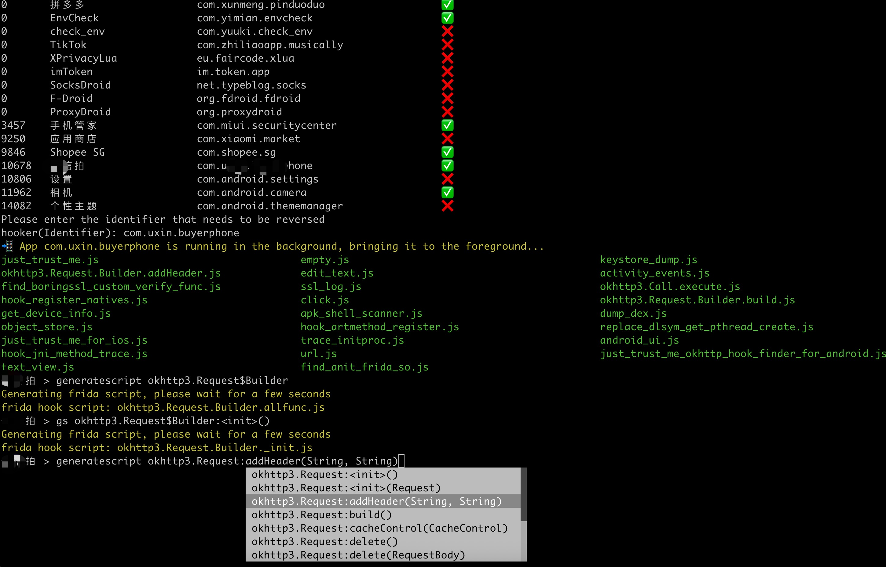

⚠️ Disclaimer
All contents of this project are intended solely for learning and technical exchange purposes. The goal is to help developers understand the structure and internal mechanisms of mobile applications.

This project does not contain any cracking operations or infringing content targeting specific applications.
Some simple unpacking techniques related to certain apps are widely available on major technical forums and do not cause actual harm to the applications.
This project is not intended to assist with any illegal activities, including but not limited to bypassing copyright protection, modifying app functionality, or accessing unauthorized data.
Please ensure compliance with relevant laws and regulations when using the tools provided by this project, and use them only for personal learning or research purposes.

<p>English | <a href="README.md">简体中文</a></p>

# 👋 Welcome to Hooker Reverse Engineering Toolkit


Hooker is a reverse engineering toolkit based on Frida, designed to provide Android reverse engineers with a comfortable command-line interface,

A unified script package management system

Universal (通杀) scripts

Automated hook script generation

In-memory roaming for detecting Activity and Service components

A Frida-based implementation of JustTrustMe

Global app support for boringssl unpinning

One picture to prove why you need Hooker:


## 📚 Table of Contents

- [Quick Start](#quick-start)
  - [1. Clone the repository](#1-clone-the-repository)
  - [2. Install Python dependencies](#2-install-python-dependencies)
  - [3. Connect your rooted device via USB](#3-connect-your-rooted-device-via-usb)
  - [4. Launch Hooker](#4-launch-hooker)
  - [5. Enter the package name of the target app](#5-enter-the-package-name-of-the-target-app)
  - [6. View help information](#6-view-help-information)
  - [7. Generate Frida hook scripts for a specific class and method](#7-generate-frida-hook-scripts-for-a-specific-class-and-method)
  - [8. List all available Frida scripts](#8-list-all-available-frida-scripts)
  - [9. Attach and execute a specific Frida script](#9-attach-and-execute-a-specific-frida-script)
  - [10. Set a SOCKS5 proxy for the app](#10-set-a-socks5-proxy-for-the-app)
  - [11. Run JustTrustMe to disable all SSL pinning (including boringssl)](#11-run-justtrustme-to-disable-all-ssl-pinning-including-boringssl)
  - [12. Spawn the app and execute a specific Frida script](#12-spawn-the-app-and-execute-a-specific-frida-script)
  - [13. Clear the proxy settings](#13-clear-the-proxy-settings)
  - [14. Restart the app](#14-restart-the-app)
  - [15. Get the app's UID and PID](#15-get-uid-and-pid)


    
    


# 🚀 Quick Start

Ensure your device is rooted. No need to manually start frida-server or do any configuration—Hooker handles everything for you.


### 1. Clone the repository
```shell
stephen@ubuntu:~$ git clone https://github.com/CreditTone/hooker.git
stephen@ubuntu:~$ cd hooker
```

### 2. Install Python dependencies
```shell
stephen@ubuntu:~/hooker$ pip3 install -r requirements.txt
```


### 3. Connect your rooted device via USB
```shell
stephen@ubuntu:~/hooker$ adb devices
List of devices attached
FA77C0301476	device
```


### 4. Launch Hooker
```shell
stephen@ubuntu:~/hooker$ python3 hooker.py
hooker Let's enjoy reverse engineering together
-----------------------------------------------------------------------------------------------
PID   	APP                 	IDENTIFIER                         	EXIST_REVERSE_DIRECTORY
0     	全球上网            	com.miui.virtualsim                	❌
0     	爱奇艺              	com.qiyi.video                     	❌
0     	红手指云手机        	com.redfinger.app                  	❌
0     	Reqable             	com.reqable.android                	❌
0     	美团                	com.sankuai.meituan                	✅
0     	得物                	com.shizhuang.duapp                	❌
0     	某皮           	     cxm.shxpxx.sg                      	✅
0     	微博                	com.sina.weibo                     	❌
0     	今日头条            	com.ss.android.article.news        	✅
0     	西瓜视频            	com.ss.android.article.video       	✅
0     	懂车帝              	com.ss.android.auto                	✅
0     	抖音火山版          	com.ss.android.ugc.live            	✅
0     	抖音精选            	com.ss.android.yumme.video         	❌
0     	淘宝                	com.taobao.taobao                  	✅
0     	腾讯视频            	com.tencent.qqlive                 	❌
0     	Termux              	com.termux                         	❌
0     	轻奢                	com.tm.bachelorparty               	✅
0     	WiFi ADB            	com.ttxapps.wifiadb                	❌
0     	VMOS Pro            	com.vmos.pro                       	✅
0     	游戏中心            	com.xiaomi.gamecenter              	❌
0     	小米商城            	com.xiaomi.shop                    	❌
0     	米家                	com.xiaomi.smarthome               	❌
0     	小米有品            	com.xiaomi.youpin                  	✅
0     	小红书              	com.xingin.xhs                     	✅
0     	运满满货主          	com.xiwei.logistics.consignor      	✅
0     	拼多多              	com.xunmeng.pinduoduo              	✅
0     	EnvCheck            	com.yimian.envcheck                	✅
0     	check_env           	com.yuuki.check_env                	❌
0     	TikTok              	com.zhiliaoapp.musically           	❌
0     	XPrivacyLua         	eu.faircode.xlua                   	❌
0     	imToken             	im.token.app                       	❌
0     	SocksDroid          	net.typeblog.socks                 	❌
0     	F-Droid             	org.fdroid.fdroid                  	❌
0     	ProxyDroid          	org.proxydroid                     	❌
3457  	手机管家            	com.miui.securitycenter            	✅
3509  	优信拍              	com.uxin.buyerphone                	✅
18780 	抖音                	com.ss.android.ugc.aweme           	✅
20174 	应用商店            	com.xiaomi.market                  	❌
20913 	设置                	com.android.settings               	❌
30500 	小爱同学            	com.miui.voiceassist               	❌
32163 	相机                	com.android.camera                 	✅
Please enter the identifier that needs to be reversed
hooker(Identifier):
```
***

### 5. Enter the package name of the target app
```shell
hooker(Identifier): cxm.shxpxx.sg
✅ App cxm.shxpxx.sg is already in the foreground
Creating working directory: cxm.shxpxx.sg
Generating frida shortcut command...
Generating built-in frida script...
pull /data/app/cxm.shxpxx.sg-L8zkrpFVICv0-hOrtmPPxA==/base.apk to cxm.shxpxx.sg/ShopeeSG_3.43.40.apk successful
Working directory create successful
just_trust_me.js                                 empty.js                                         keystore_dump.js
edit_text.js                                     activity_events.js                               find_boringssl_custom_verify_func.js
ssl_log.js                                       hook_register_natives.js                         click.js
get_device_info.js                               apk_shell_scanner.js                             dump_dex.js
object_store.js                                  hook_artmethod_register.js                       replace_dlsym_get_pthread_create.js
just_trust_me_for_ios.js                         trace_initproc.js                                android_ui.js
hook_jni_method_trace.js                         url.js                                           just_trust_me_okhttp_hook_finder_for_android.js
text_view.js                                     find_anit_frida_so.js
某皮 > 
```
***


### 6. View help information

```shell
某皮 > help
h, help                                      show this help message
a, activitys                                 show the activity stack
s, services                                  show the service stack
o, object [object_id]                        show object info by object_id
v, view [view_id]                            show view info by view_id of view
gs, generatescript [class_name:method_name]  specify the class name and method name to generate a frida hook java script file. For example: generatescript
                                             okhttp3.Request$Builder:addHeader
p, proxy [socks5_proxy_server]               set up a socks5 proxy for this app. For example: proxy socks5://192.168.0.100:9998
up, unproxy                                  remove socks5 proxy for this app
trust, justtrustme                           quickly spawn just_trust_me.js script to kill all ssl pinning
ls                                           list all the frida scripts of the current app
attach [script_file_name]                    quickly execute a frida script, similar to executing the command "frida -U com.example.app -l xxx.js". For example: attach url.js
spawn [script_file_name]                     quickly spawn a frida script, similar to executing the command "frida -U -f -n com.example.app -l xxx.js". For example: spawn
                                             just_trust_me.js
restart                                      restart this app
pid                                          get pid of this app main process
uid                                          get pid of this app
exit                                         return to the previous level
某皮 > 
```
***


### 7. Generate Frida hook scripts for a specific class and method


- Command Syntax：gs, generatescript [class_name:method_name]


- 7.1 Generate a Frida hook script for a specific method:
gs okhttp3.Request$Builder:addHeader — the parameter part (String, String) is not required.

```shell
某信拍 > gs okhttp3.Request$Builder:addHeader(String, String)
Generating frida script, please wait for a few seconds
frida hook script: okhttp3.Request.Builder.addHeader.js
某信拍 > 
```

```js
//cat okhttp3.Request.Builder.addHeader.js
Java.perform(function() {
    var okhttp3_Request_Builder_clz = Java.use('okhttp3.Request$Builder');
    var okhttp3_Request_Builder_clz_method_addHeader_2grl = okhttp3_Request_Builder_clz.addHeader.overload('java.lang.String', 'java.lang.String');
    okhttp3_Request_Builder_clz_method_addHeader_2grl.implementation = function(string, string_x2) {
        var executor = this.hashCode();
        var beatText = 'public okhttp3.Request$Builder okhttp3.Request$Builder.addHeader(java.lang.String,java.lang.String)';
        var beat = newMethodBeat(beatText, executor);
        var ret = okhttp3_Request_Builder_clz_method_addHeader_2grl.call(this, string, string_x2);
        console.log("header name:" + string + " header value:" + string_x2);
        printBeat(beat);
        return ret;
    };
});
```
***


- 7.2 Generate a Frida hook script for all member methods of a specified class:
gs okhttp3.Request$Builder

```shell
某信拍 > generatescript okhttp3.Request$Builder
Generating frida script, please wait for a few seconds
frida hook script: okhttp3.Request.Builder.allfunc.js
```
***

```js
//cat okhttp3.Request.Builder.allfunc.js
//okhttp3.Request$Builder
Java.perform(function() {
    var okhttp3_Request_Builder_clz = Java.use('okhttp3.Request$Builder');
    var okhttp3_Request_Builder_clz_method_header_ng3n = okhttp3_Request_Builder_clz.header.overload('java.lang.String', 'java.lang.String');
    okhttp3_Request_Builder_clz_method_header_ng3n.implementation = function(string, string_x2) {
        var executor = this.hashCode();
        var beatText = 'public okhttp3.Request$Builder okhttp3.Request$Builder.header(java.lang.String,java.lang.String)';
        var beat = newMethodBeat(beatText, executor);
        var ret = okhttp3_Request_Builder_clz_method_header_ng3n.call(this, string, string_x2);
        printBeat(beat);
        return ret;
    };
    var okhttp3_Request_Builder_clz_method_cacheControl_q8q5 = okhttp3_Request_Builder_clz.cacheControl.overload('okhttp3.CacheControl');
    okhttp3_Request_Builder_clz_method_cacheControl_q8q5.implementation = function(cacheControl) {
        var executor = this.hashCode();
        var beatText = 'public okhttp3.Request$Builder okhttp3.Request$Builder.cacheControl(okhttp3.CacheControl)';
        var beat = newMethodBeat(beatText, executor);
        var ret = okhttp3_Request_Builder_clz_method_cacheControl_q8q5.call(this, cacheControl);
        printBeat(beat);
        return ret;
    };
    var okhttp3_Request_Builder_clz_method_method_bjk9 = okhttp3_Request_Builder_clz.method.overload('java.lang.String', 'okhttp3.RequestBody');
    okhttp3_Request_Builder_clz_method_method_bjk9.implementation = function(string, requestBody) {
        var executor = this.hashCode();
        var beatText = 'public okhttp3.Request$Builder okhttp3.Request$Builder.method(java.lang.String,okhttp3.RequestBody)';
        var beat = newMethodBeat(beatText, executor);
        var ret = okhttp3_Request_Builder_clz_method_method_bjk9.call(this, string, requestBody);
        printBeat(beat);
        return ret;
    };
    var okhttp3_Request_Builder_clz_method_head_a5nq = okhttp3_Request_Builder_clz.head.overload();
    okhttp3_Request_Builder_clz_method_head_a5nq.implementation = function() {
        var executor = this.hashCode();
        var beatText = 'public okhttp3.Request$Builder okhttp3.Request$Builder.head()';
        var beat = newMethodBeat(beatText, executor);
        var ret = okhttp3_Request_Builder_clz_method_head_a5nq.call(this);
        printBeat(beat);
        return ret;
    };
    var okhttp3_Request_Builder_clz_method_headers_to5i = okhttp3_Request_Builder_clz.headers.overload('okhttp3.Headers');
    okhttp3_Request_Builder_clz_method_headers_to5i.implementation = function(headers) {
        var executor = this.hashCode();
        var beatText = 'public okhttp3.Request$Builder okhttp3.Request$Builder.headers(okhttp3.Headers)';
        var beat = newMethodBeat(beatText, executor);
        var ret = okhttp3_Request_Builder_clz_method_headers_to5i.call(this, headers);
        printBeat(beat);
        return ret;
    };
    var okhttp3_Request_Builder_clz_method_post_heaq = okhttp3_Request_Builder_clz.post.overload('okhttp3.RequestBody');
    okhttp3_Request_Builder_clz_method_post_heaq.implementation = function(requestBody) {
        var executor = this.hashCode();
        var beatText = 'public okhttp3.Request$Builder okhttp3.Request$Builder.post(okhttp3.RequestBody)';
        var beat = newMethodBeat(beatText, executor);
        var ret = okhttp3_Request_Builder_clz_method_post_heaq.call(this, requestBody);
        printBeat(beat);
        return ret;
    };
    var okhttp3_Request_Builder_clz_method_build_rmqx = okhttp3_Request_Builder_clz.build.overload();
    okhttp3_Request_Builder_clz_method_build_rmqx.implementation = function() {
        var executor = this.hashCode();
        var beatText = 'public okhttp3.Request okhttp3.Request$Builder.build()';
        var beat = newMethodBeat(beatText, executor);
        var ret = okhttp3_Request_Builder_clz_method_build_rmqx.call(this);
        printBeat(beat);
        return ret;
    };
    var okhttp3_Request_Builder_clz_method_patch_hp9u = okhttp3_Request_Builder_clz.patch.overload('okhttp3.RequestBody');
    okhttp3_Request_Builder_clz_method_patch_hp9u.implementation = function(requestBody) {
        var executor = this.hashCode();
        var beatText = 'public okhttp3.Request$Builder okhttp3.Request$Builder.patch(okhttp3.RequestBody)';
        var beat = newMethodBeat(beatText, executor);
        var ret = okhttp3_Request_Builder_clz_method_patch_hp9u.call(this, requestBody);
        printBeat(beat);
        return ret;
    };
    var okhttp3_Request_Builder_clz_method_url_0owi = okhttp3_Request_Builder_clz.url.overload('java.lang.String');
    okhttp3_Request_Builder_clz_method_url_0owi.implementation = function(string) {
        var executor = this.hashCode();
        var beatText = 'public okhttp3.Request$Builder okhttp3.Request$Builder.url(java.lang.String)';
        var beat = newMethodBeat(beatText, executor);
        var ret = okhttp3_Request_Builder_clz_method_url_0owi.call(this, string);
        printBeat(beat);
        return ret;
    };
    var okhttp3_Request_Builder_clz_method_removeHeader_uzb9 = okhttp3_Request_Builder_clz.removeHeader.overload('java.lang.String');
    okhttp3_Request_Builder_clz_method_removeHeader_uzb9.implementation = function(string) {
        var executor = this.hashCode();
        var beatText = 'public okhttp3.Request$Builder okhttp3.Request$Builder.removeHeader(java.lang.String)';
        var beat = newMethodBeat(beatText, executor);
        var ret = okhttp3_Request_Builder_clz_method_removeHeader_uzb9.call(this, string);
        printBeat(beat);
        return ret;
    };
    var okhttp3_Request_Builder_clz_method_url_ykbd = okhttp3_Request_Builder_clz.url.overload('java.net.URL');
    okhttp3_Request_Builder_clz_method_url_ykbd.implementation = function(url) {
        var executor = this.hashCode();
        var beatText = 'public okhttp3.Request$Builder okhttp3.Request$Builder.url(java.net.URL)';
        var beat = newMethodBeat(beatText, executor);
        var ret = okhttp3_Request_Builder_clz_method_url_ykbd.call(this, url);
        printBeat(beat);
        return ret;
    };
    var okhttp3_Request_Builder_clz_method_delete_dqyl = okhttp3_Request_Builder_clz.delete.overload();
    okhttp3_Request_Builder_clz_method_delete_dqyl.implementation = function() {
        var executor = this.hashCode();
        var beatText = 'public okhttp3.Request$Builder okhttp3.Request$Builder.delete()';
        var beat = newMethodBeat(beatText, executor);
        var ret = okhttp3_Request_Builder_clz_method_delete_dqyl.call(this);
        printBeat(beat);
        return ret;
    };
    //.......省略N行代码
```
***


- 7.3 Generate a Frida hook script for the constructor(s) of a specified class:
gs okhttp3.Request$Builder:_ or gs okhttp3.Request$Builder:\<init\>

```shell
某信拍 > gs okhttp3.Request$Builder:<init>()
Generating frida script, please wait for a few seconds
frida hook script: okhttp3.Request.Builder._init.js
```

```js
//cat okhttp3.Request.Builder._init.js
//okhttp3.Request$Builder:<init>()
Java.perform(function() {
    var okhttp3_Request_Builder_clz = Java.use('okhttp3.Request$Builder');
    var okhttp3_Request_Builder_clz_init_uw3i = okhttp3_Request_Builder_clz.$init.overload();
    okhttp3_Request_Builder_clz_init_uw3i.implementation = function() {
        var executor = this.hashCode();
        var beatText = 'public okhttp3.Request$Builder()';
        var beat = newMethodBeat(beatText, executor);
        var returnObj = okhttp3_Request_Builder_clz_init_uw3i.call(this);
        printBeat(beat);
        return returnObj;
    };
    var okhttp3_Request_Builder_clz_init_e58t = okhttp3_Request_Builder_clz.$init.overload('okhttp3.Request');
    okhttp3_Request_Builder_clz_init_e58t.implementation = function(v0) {
        var executor = this.hashCode();
        var beatText = 'okhttp3.Request$Builder(okhttp3.Request)';
        var beat = newMethodBeat(beatText, executor);
        var returnObj = okhttp3_Request_Builder_clz_init_e58t.call(this, v0);
        printBeat(beat);
        return returnObj;
    };
});
```
***

### 8. List all available Frida scripts
```shell
某皮 > ls
just_trust_me.js                                 empty.js                                         keystore_dump.js
okhttp3.Request.Builder.addHeader.js             edit_text.js                                     activity_events.js
find_boringssl_custom_verify_func.js             ssl_log.js                                       hook_register_natives.js
click.js                                         get_device_info.js                               apk_shell_scanner.js
dump_dex.js                                      object_store.js                                  hook_artmethod_register.js
replace_dlsym_get_pthread_create.js              just_trust_me_for_ios.js                         trace_initproc.js
android_ui.js                                    hook_jni_method_trace.js                         url.js
just_trust_me_okhttp_hook_finder_for_android.js  text_view.js                                     find_anit_frida_so.js
某皮 >
```
***

### 9. Attach and execute a specific Frida script
```shell
某信拍 > attach url.js
------------startFlag:0755liv1,objectHash:-915348569,thread(id:810,name:Wmda.EventUploadThread),timestamp:1747836814835---------------
url:https://apiwmxx.xxx.com.cn/report/c?api_v=3&sdk_v=1.7.0.0&timestamp=1747836814832&appid=17591177894321&p=2&uuid=248056262e0030b7bb56c0f9237f846d
public java.net.URL(String)
	at java.net.URL.<init>(Native Method)
	at com.wxbx.wmda.e.b.a(SourceFile:5)
	at com.wxbx.wmda.e.b.a(SourceFile:1)
	at com.wxbx.wmda.h.a.a(SourceFile:162)
	at com.wxbx.wmda.h.a.b(SourceFile:19)
	at com.wxbx.wmda.h.a.a(SourceFile:2)
	at com.wxbx.wmda.h.a$b.handleMessage(SourceFile:3)
	at android.os.Handler.dispatchMessage(Handler.java:106)
	at android.os.Looper.loop(Looper.java:201)
	at android.os.HandlerThread.run(HandlerThread.java:65)
------------endFlag:0755liv1,usedtime:1---------------

------------startFlag:1ps6go99,objectHash:-237375819,thread(id:810,name:Wmda.EventUploadThread),timestamp:1747836815192---------------
url:https://apiwmxx.xxx.com.cn/report/c?api_v=3&sdk_v=1.7.0.0&timestamp=1747836815188&appid=17591177894321&p=2&uuid=248056262e0030b7bb56c0f9237f846d
public java.net.URL(String)
	at java.net.URL.<init>(Native Method)
	at com.android.okhttp.HttpUrl.url(HttpUrl.java:327)
	at com.android.okhttp.Request.url(Request.java:53)
	at com.android.okhttp.Request$Builder.build(Native Method)
	at com.android.okhttp.internal.huc.HttpURLConnectionImpl.newHttpEngine(HttpURLConnectionImpl.java:377)
	at com.android.okhttp.internal.huc.HttpURLConnectionImpl.initHttpEngine(HttpURLConnectionImpl.java:332)
	at com.android.okhttp.internal.huc.HttpURLConnectionImpl.connect(HttpURLConnectionImpl.java:124)
	at com.android.okhttp.internal.huc.HttpURLConnectionImpl.getOutputStream(HttpURLConnectionImpl.java:258)
	at com.android.okhttp.internal.huc.DelegatingHttpsURLConnection.getOutputStream(DelegatingHttpsURLConnection.java:218)
	at com.android.okhttp.internal.huc.HttpsURLConnectionImpl.getOutputStream(HttpsURLConnectionImpl.java:26)
	at com.wxbx.wmda.e.b.a(SourceFile:14)
	at com.wxbx.wmda.e.b.a(SourceFile:1)
	at com.wxbx.wmda.h.a.a(SourceFile:162)
	at com.wxbx.wmda.h.a.b(SourceFile:19)
	at com.wxbx.wmda.h.a.a(SourceFile:2)
	at com.wxbx.wmda.h.a$b.handleMessage(SourceFile:3)
	at android.os.Handler.dispatchMessage(Handler.java:106)
	at android.os.Looper.loop(Looper.java:201)
	at android.os.HandlerThread.run(HandlerThread.java:65)
------------endFlag:1ps6go99,usedtime:0---------------
// 这里省略无数日志.............
------------startFlag:i7osxvjl,objectHash:134280600,thread(id:810,name:Wmda.EventUploadThread),timestamp:1747836815193---------------
url:https://apiwmxx.xxx.com.cn/report/c?api_v=3&sdk_v=1.7.0.0&timestamp=1747836815188&appid=17591177894321&p=2&uuid=248056262e0030b7bb56c0f9237f846d
com.android.okhttp.Request.Builder.build()
	at com.android.okhttp.Request$Builder.build(Native Method)
	at com.android.okhttp.internal.huc.HttpURLConnectionImpl.newHttpEngine(HttpURLConnectionImpl.java:377)
	at com.android.okhttp.internal.huc.HttpURLConnectionImpl.initHttpEngine(HttpURLConnectionImpl.java:332)
	at com.android.okhttp.internal.huc.HttpURLConnectionImpl.connect(HttpURLConnectionImpl.java:124)
	at com.android.okhttp.internal.huc.HttpURLConnectionImpl.getOutputStream(HttpURLConnectionImpl.java:258)
	at com.android.okhttp.internal.huc.DelegatingHttpsURLConnection.getOutputStream(DelegatingHttpsURLConnection.java:218)
	at com.android.okhttp.internal.huc.HttpsURLConnectionImpl.getOutputStream(HttpsURLConnectionImpl.java:26)
	at com.wxbx.wmda.e.b.a(SourceFile:14)
	at com.wxbx.wmda.e.b.a(SourceFile:1)
	at com.wxbx.wmda.h.a.a(SourceFile:162)
	at com.wxbx.wmda.h.a.b(SourceFile:19)
	at com.wxbx.wmda.h.a.a(SourceFile:2)
	at com.wxbx.wmda.h.a$b.handleMessage(SourceFile:3)
	at android.os.Handler.dispatchMessage(Handler.java:106)
	at android.os.Looper.loop(Looper.java:201)
	at android.os.HandlerThread.run(HandlerThread.java:65)
------------endFlag:i7osxvjl,usedtime:1---------------
// 这里省略无数日志.............
```
***

### 10. Set a SOCKS5 proxy for the app
```shell
某音 > proxy socks5://10.112.99.11:9998
proxy socks5://10.112.99.11:9998 OK
某音 > 
```
***


### 11. Run JustTrustMe to disable all SSL pinning (including boringssl)

```shell
某音 > justtrustme
Package name: com.ss.xxxx.xxx.aweme
android.security.net.config.NetworkSecurityTrustManager.checkPins('java.util.List') was hooked!
android.security.net.config.NetworkSecurityTrustManager.checkPins('java.util.List') was hooked!
android.security.net.config.NetworkSecurityTrustManager.checkPins('java.util.List') was hooked!
android.security.net.config.NetworkSecurityTrustManager.checkPins('java.util.List') was hooked!
javax.net.ssl.TrustManagerFactory.getTrustManagers() was hooked!
javax.net.ssl.SSLContext.init('[Ljavax.net.ssl.KeyManager;', '[Ljavax.net.ssl.TrustManager;', 'java.security.SecureRandom') was hooked!
javax.net.ssl.TrustManagerFactory.getTrustManagers() was hooked!
javax.net.ssl.SSLContext.init('[Ljavax.net.ssl.KeyManager;', '[Ljavax.net.ssl.TrustManager;', 'java.security.SecureRandom') was hooked!
javax.net.ssl.TrustManagerFactory.getTrustManagers() was hooked!
javax.net.ssl.SSLContext.init('[Ljavax.net.ssl.KeyManager;', '[Ljavax.net.ssl.TrustManager;', 'java.security.SecureRandom') was hooked!
javax.net.ssl.SSLContext.init('[Ljavax.net.ssl.KeyManager;', '[Ljavax.net.ssl.TrustManager;', 'java.security.SecureRandom') was hooked!
static void com.android.org.conscrypt.Platform.checkServerTrusted(javax.net.ssl.X509TrustManager,java.security.cert.X509Certificate[],java.lang.String,com.android.org.conscrypt.AbstractConscryptSocket) throws java.security.cert.CertificateException was hooked!
static void com.android.org.conscrypt.Platform.checkServerTrusted(javax.net.ssl.X509TrustManager,java.security.cert.X509Certificate[],java.lang.String,com.android.org.conscrypt.AbstractConscryptSocket) throws java.security.cert.CertificateException was hooked!
static void com.android.org.conscrypt.Platform.checkServerTrusted(javax.net.ssl.X509TrustManager,java.security.cert.X509Certificate[],java.lang.String,com.android.org.conscrypt.AbstractConscryptSocket) throws java.security.cert.CertificateException was hooked!
static void com.android.org.conscrypt.Platform.checkServerTrusted(javax.net.ssl.X509TrustManager,java.security.cert.X509Certificate[],java.lang.String,com.android.org.conscrypt.AbstractConscryptSocket) throws java.security.cert.CertificateException was hooked!
okhttp3.internal.tls.OkHostnameVerifier.verify('java.lang.String', 'javax.net.ssl.SSLSession') was hooked!
okhttp3.CertificatePinner.check('java.lang.String', 'java.util.List') was hooked!
static void com.android.org.conscrypt.Platform.checkServerTrusted(javax.net.ssl.X509TrustManager,java.security.cert.X509Certificate[],java.lang.String,com.android.org.conscrypt.AbstractConscryptSocket) throws java.security.cert.CertificateException was hooked!
static void com.android.org.conscrypt.Platform.checkServerTrusted(javax.net.ssl.X509TrustManager,java.security.cert.X509Certificate[],java.lang.String,com.android.org.conscrypt.AbstractConscryptSocket) throws java.security.cert.CertificateException was hooked!
okhttp3.internal.tls.OkHostnameVerifier.verify('java.lang.String', 'javax.net.ssl.SSLSession') was hooked!
okhttp3.CertificatePinner.check('java.lang.String', 'java.util.List') was hooked!
okhttp3.internal.tls.OkHostnameVerifier.verify('java.lang.String', 'javax.net.ssl.SSLSession') was hooked!
okhttp3.internal.tls.OkHostnameVerifier.verify('java.lang.String', 'javax.net.ssl.SSLSession') was hooked!
okhttp3.internal.tls.OkHostnameVerifier.verify('java.lang.String', 'javax.net.ssl.SSLSession') was hooked!
okhttp3.CertificatePinner.check('java.lang.String', 'java.util.List') was hooked!
okhttp3.CertificatePinner.check('java.lang.String', 'java.util.List') was hooked!
okhttp3.CertificatePinner.check('java.lang.String', 'java.util.List') was hooked!
static void com.android.org.conscrypt.Platform.checkServerTrusted(javax.net.ssl.X509TrustManager,java.security.cert.X509Certificate[],java.lang.String,com.android.org.conscrypt.AbstractConscryptSocket) throws java.security.cert.CertificateException was hooked!
okhttp3.internal.tls.OkHostnameVerifier.verify('java.lang.String', 'javax.net.ssl.SSLSession') was hooked!
okhttp3.CertificatePinner.check('java.lang.String', 'java.util.List') was hooked!
okhttp3.CertificatePinner.check('java.lang.String', 'java.util.List') was hooked!
okhttp3.CertificatePinner.check('java.lang.String', 'java.util.List') was hooked!
// 这里省略无数日志.............
```
***


### 12. Spawn the app and execute a specific Frida script
```shell
某信拍 > spawn just_trust_me.js
Package name: com.xxx.buyxxphone
javax.net.ssl.SSLContext.init('[Ljavax.net.ssl.KeyManager;', '[Ljavax.net.ssl.TrustManager;', 'java.security.SecureRandom') was hooked!
javax.net.ssl.TrustManagerFactory.getTrustManagers() was hooked!
javax.net.ssl.SSLContext.init('[Ljavax.net.ssl.KeyManager;', '[Ljavax.net.ssl.TrustManager;', 'java.security.SecureRandom') was hooked!
// 这里省略无数日志.............
```
***


### 13. Clear the proxy settings
```shell
某音 > unproxy
unproxy OK
某音 > 
```
***


### 14. Restart the app

```shell
某信拍 > restart
restarts com.xxx.buyxxphone
```
***


### 15. Get UID and PID
```shell
某信拍 > uid
10189
某信拍 > pid
3509
```
***

